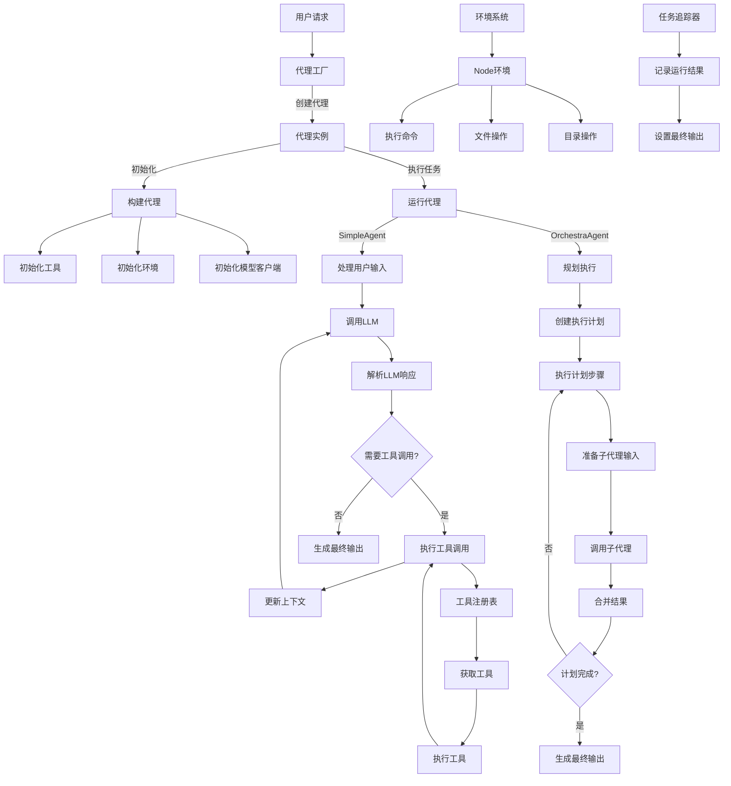

# Node.js 版本 youtu-agent 架构设计

## 整体架构

Node.js 版本的 youtu-agent 采用模块化设计，主要包含以下核心组件：

1. **代理系统**：包括基础代理类、简单代理和编排代理
2. **工具系统**：工具注册表和工具管理
3. **环境系统**：环境配置和管理
4. **任务追踪**：记录代理执行过程和结果

## 代码逻辑流程图

## 核心组件详细说明

### 1. 代理系统

#### BaseAgent
基础代理类，提供所有代理共享的核心功能：
- 工具管理
- 上下文管理
- 环境配置
- 任务追踪

#### SimpleAgent
简单代理类，继承自BaseAgent，实现与LLM的交互：
- 初始化模型客户端
- 处理用户输入
- 调用LLM并解析响应
- 执行工具调用
- 生成最终输出

#### OrchestraAgent
编排代理类，继承自BaseAgent，实现多代理协作：
- 管理子代理
- 创建执行计划
- 执行计划步骤
- 合并子代理结果
- 生成最终输出

### 2. 工具系统

#### ToolRegistry
工具注册表，管理所有可用工具：
- 注册工具
- 获取工具
- 移除工具

### 3. 环境系统

#### BaseEnv
基础环境类，定义环境接口：
- 构建环境
- 执行动作
- 获取观察
- 清理环境

#### NodeEnv
Node.js环境类，提供Node.js特定功能：
- 执行命令
- 文件操作
- 目录操作
- 环境变量管理

### 4. 任务追踪

#### TaskRecorder
任务记录器，记录代理执行过程和结果：
- 记录输入
- 记录运行结果
- 设置最终输出
- 记录执行时间和状态

## 数据流

1. **用户请求** → 代理工厂创建适当的代理实例
2. **代理初始化** → 构建工具、环境和模型客户端
3. **任务执行** → 代理处理输入并生成输出
   - SimpleAgent: 直接与LLM交互，执行工具调用
   - OrchestraAgent: 规划并协调多个子代理执行任务
4. **结果返回** → 代理生成最终输出并返回给用户

## 扩展性设计

系统设计考虑了良好的扩展性：
1. **新代理类型**：可以通过继承BaseAgent创建新的代理类型
2. **新工具**：可以通过工具注册表注册新工具
3. **新环境**：可以通过继承BaseEnv创建新的环境类型
4. **新模型集成**：可以通过实现模型客户端接口集成新的LLM