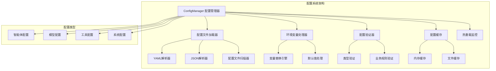
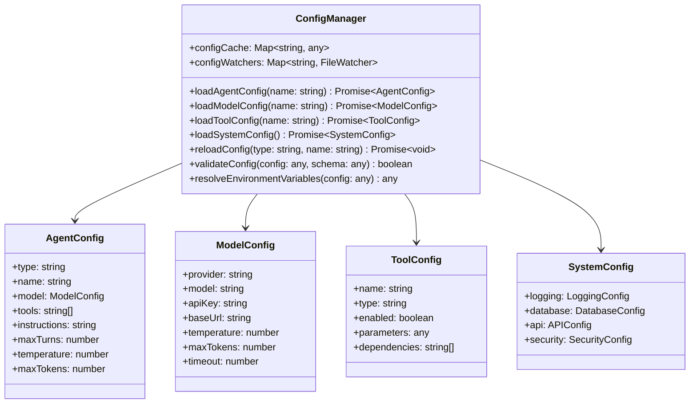

# youtu-agent-ts 配置管理详解

## 概述

配置管理是youtu-agent-ts框架的核心组件之一，负责加载、解析、验证和管理各种配置文件。框架采用YAML格式的配置文件，支持环境变量替换、配置继承、热重载等高级功能，为智能体、工具、模型等组件提供灵活的配置支持。

## 配置系统架构

### 整体架构图



### 配置层次结构



## ConfigManager 核心实现

### 配置管理器

```typescript
export class ConfigManager {
  private configCache: Map<string, any> = new Map();
  private configWatchers: Map<string, FileWatcher> = new Map();
  private configPaths: Map<string, string> = new Map();
  private logger: Logger;
  
  constructor(configBasePath: string = './configs') {
    this.logger = new Logger('ConfigManager');
    this.configBasePath = configBasePath;
    this.initializeConfigPaths();
  }
  
  /**
   * 初始化配置路径
   */
  private initializeConfigPaths(): void {
    this.configPaths.set('agents', path.join(this.configBasePath, 'agents'));
    this.configPaths.set('models', path.join(this.configBasePath, 'model'));
    this.configPaths.set('tools', path.join(this.configBasePath, 'tools'));
    this.configPaths.set('system', path.join(this.configBasePath, 'system'));
  }
  
  /**
   * 加载智能体配置
   */
  async loadAgentConfig(name: string): Promise<AgentConfig> {
    const cacheKey = `agent:${name}`;
    
    // 检查缓存
    if (this.configCache.has(cacheKey)) {
      return this.configCache.get(cacheKey);
    }
    
    try {
      const configPath = path.join(this.configPaths.get('agents')!, `${name}.yaml`);
      const config = await this.loadConfigFile(configPath);
      
      // 验证配置
      this.validateAgentConfig(config);
      
      // 解析环境变量
      const resolvedConfig = this.resolveEnvironmentVariables(config);
      
      // 缓存配置
      this.configCache.set(cacheKey, resolvedConfig);
      
      // 设置文件监控
      this.watchConfigFile(configPath, cacheKey);
      
      this.logger.info(`智能体配置 ${name} 加载成功`);
      return resolvedConfig;
    } catch (error) {
      this.logger.error(`加载智能体配置失败: ${name}`, error);
      throw error;
    }
  }
  
  /**
   * 加载模型配置
   */
  async loadModelConfig(name: string): Promise<ModelConfig> {
    const cacheKey = `model:${name}`;
    
    if (this.configCache.has(cacheKey)) {
      return this.configCache.get(cacheKey);
    }
    
    try {
      const configPath = path.join(this.configPaths.get('models')!, `${name}.yaml`);
      const config = await this.loadConfigFile(configPath);
      
      this.validateModelConfig(config);
      const resolvedConfig = this.resolveEnvironmentVariables(config);
      
      this.configCache.set(cacheKey, resolvedConfig);
      this.watchConfigFile(configPath, cacheKey);
      
      this.logger.info(`模型配置 ${name} 加载成功`);
      return resolvedConfig;
    } catch (error) {
      this.logger.error(`加载模型配置失败: ${name}`, error);
      throw error;
    }
  }
  
  /**
   * 加载工具配置
   */
  async loadToolConfig(name: string): Promise<ToolConfig> {
    const cacheKey = `tool:${name}`;
    
    if (this.configCache.has(cacheKey)) {
      return this.configCache.get(cacheKey);
    }
    
    try {
      const configPath = path.join(this.configPaths.get('tools')!, `${name}.yaml`);
      const config = await this.loadConfigFile(configPath);
      
      this.validateToolConfig(config);
      const resolvedConfig = this.resolveEnvironmentVariables(config);
      
      this.configCache.set(cacheKey, resolvedConfig);
      this.watchConfigFile(configPath, cacheKey);
      
      this.logger.info(`工具配置 ${name} 加载成功`);
      return resolvedConfig;
    } catch (error) {
      this.logger.error(`加载工具配置失败: ${name}`, error);
      throw error;
    }
  }
}
```

### 配置文件加载

```typescript
export class ConfigManager {
  /**
   * 加载配置文件
   */
  private async loadConfigFile(filePath: string): Promise<any> {
    try {
      // 检查文件是否存在
      await fs.access(filePath);
      
      // 读取文件内容
      const content = await fs.readFile(filePath, 'utf-8');
      
      // 根据文件扩展名选择解析器
      const ext = path.extname(filePath).toLowerCase();
      
      switch (ext) {
        case '.yaml':
        case '.yml':
          return this.parseYAML(content);
        case '.json':
          return this.parseJSON(content);
        default:
          throw new Error(`不支持的配置文件格式: ${ext}`);
      }
    } catch (error) {
      if (error.code === 'ENOENT') {
        throw new Error(`配置文件不存在: ${filePath}`);
      }
      throw error;
    }
  }
  
  /**
   * 解析YAML配置
   */
  private parseYAML(content: string): any {
    try {
      return yaml.parse(content);
    } catch (error) {
      throw new Error(`YAML解析失败: ${error.message}`);
    }
  }
  
  /**
   * 解析JSON配置
   */
  private parseJSON(content: string): any {
    try {
      return JSON.parse(content);
    } catch (error) {
      throw new Error(`JSON解析失败: ${error.message}`);
    }
  }
  
  /**
   * 扫描配置文件
   */
  async scanConfigFiles(type: string): Promise<string[]> {
    const configPath = this.configPaths.get(type);
    if (!configPath) {
      throw new Error(`未知的配置类型: ${type}`);
    }
    
    try {
      const files = await fs.readdir(configPath);
      return files
        .filter(file => file.endsWith('.yaml') || file.endsWith('.yml') || file.endsWith('.json'))
        .map(file => path.basename(file, path.extname(file)));
    } catch (error) {
      this.logger.warn(`扫描配置目录失败: ${configPath}`, error);
      return [];
    }
  }
}
```

### 环境变量处理

```typescript
export class ConfigManager {
  /**
   * 解析环境变量
   */
  private resolveEnvironmentVariables(config: any): any {
    if (typeof config === 'string') {
      return this.resolveStringVariables(config);
    } else if (Array.isArray(config)) {
      return config.map(item => this.resolveEnvironmentVariables(item));
    } else if (config && typeof config === 'object') {
      const resolved: any = {};
      for (const [key, value] of Object.entries(config)) {
        resolved[key] = this.resolveEnvironmentVariables(value);
      }
      return resolved;
    }
    return config;
  }
  
  /**
   * 解析字符串中的环境变量
   */
  private resolveStringVariables(str: string): string {
    // 支持 ${VAR_NAME} 和 ${VAR_NAME:default_value} 格式
    return str.replace(/\$\{([^}:]+)(?::([^}]*))?\}/g, (match, varName, defaultValue) => {
      const value = process.env[varName];
      if (value !== undefined) {
        return value;
      }
      if (defaultValue !== undefined) {
        return defaultValue;
      }
      throw new Error(`环境变量未定义: ${varName}`);
    });
  }
  
  /**
   * 验证必需的环境变量
   */
  private validateRequiredEnvVars(config: any, requiredVars: string[]): void {
    const missingVars: string[] = [];
    
    for (const varName of requiredVars) {
      if (!process.env[varName]) {
        missingVars.push(varName);
      }
    }
    
    if (missingVars.length > 0) {
      throw new Error(`缺少必需的环境变量: ${missingVars.join(', ')}`);
    }
  }
}
```

### 配置验证

```typescript
export class ConfigManager {
  /**
   * 验证智能体配置
   */
  private validateAgentConfig(config: any): void {
    const schema = {
      type: { required: true, type: 'string', enum: ['simple', 'orchestra', 'workforce'] },
      name: { required: true, type: 'string', minLength: 1 },
      model: { required: true, type: 'object' },
      tools: { required: false, type: 'array' },
      instructions: { required: false, type: 'string' },
      maxTurns: { required: false, type: 'number', min: 1, max: 100 },
      temperature: { required: false, type: 'number', min: 0, max: 2 },
      maxTokens: { required: false, type: 'number', min: 1, max: 100000 }
    };
    
    this.validateConfigSchema(config, schema);
    
    // 验证模型配置
    if (config.model) {
      this.validateModelConfig(config.model);
    }
  }
  
  /**
   * 验证模型配置
   */
  private validateModelConfig(config: any): void {
    const schema = {
      provider: { required: true, type: 'string', enum: ['openai', 'anthropic', 'google', 'deepseek', 'local', 'custom'] },
      model: { required: true, type: 'string', minLength: 1 },
      apiKey: { required: false, type: 'string' },
      baseUrl: { required: false, type: 'string' },
      temperature: { required: false, type: 'number', min: 0, max: 2 },
      maxTokens: { required: false, type: 'number', min: 1, max: 100000 },
      timeout: { required: false, type: 'number', min: 1000, max: 300000 }
    };
    
    this.validateConfigSchema(config, schema);
  }
  
  /**
   * 验证工具配置
   */
  private validateToolConfig(config: any): void {
    const schema = {
      name: { required: true, type: 'string', minLength: 1 },
      type: { required: true, type: 'string', enum: ['builtin', 'custom', 'external'] },
      enabled: { required: false, type: 'boolean' },
      parameters: { required: false, type: 'object' },
      dependencies: { required: false, type: 'array' }
    };
    
    this.validateConfigSchema(config, schema);
  }
  
  /**
   * 验证配置模式
   */
  private validateConfigSchema(config: any, schema: any): void {
    for (const [key, rules] of Object.entries(schema)) {
      const value = config[key];
      const rule = rules as any;
      
      // 检查必需字段
      if (rule.required && (value === undefined || value === null)) {
        throw new Error(`配置字段 ${key} 是必需的`);
      }
      
      if (value === undefined || value === null) {
        continue;
      }
      
      // 检查类型
      if (rule.type && typeof value !== rule.type) {
        throw new Error(`配置字段 ${key} 必须是 ${rule.type} 类型`);
      }
      
      // 检查枚举值
      if (rule.enum && !rule.enum.includes(value)) {
        throw new Error(`配置字段 ${key} 必须是以下值之一: ${rule.enum.join(', ')}`);
      }
      
      // 检查字符串长度
      if (rule.type === 'string') {
        if (rule.minLength && value.length < rule.minLength) {
          throw new Error(`配置字段 ${key} 长度不能少于 ${rule.minLength}`);
        }
        if (rule.maxLength && value.length > rule.maxLength) {
          throw new Error(`配置字段 ${key} 长度不能超过 ${rule.maxLength}`);
        }
      }
      
      // 检查数值范围
      if (rule.type === 'number') {
        if (rule.min !== undefined && value < rule.min) {
          throw new Error(`配置字段 ${key} 不能小于 ${rule.min}`);
        }
        if (rule.max !== undefined && value > rule.max) {
          throw new Error(`配置字段 ${key} 不能超过 ${rule.max}`);
        }
      }
    }
  }
}
```

## 热重载功能

### 文件监控

```typescript
export class ConfigManager {
  /**
   * 监控配置文件变化
   */
  private watchConfigFile(filePath: string, cacheKey: string): void {
    if (this.configWatchers.has(cacheKey)) {
      return; // 已经在监控
    }
    
    try {
      const watcher = fs.watch(filePath, { persistent: false }, (eventType) => {
        if (eventType === 'change') {
          this.handleConfigChange(cacheKey, filePath);
        }
      });
      
      this.configWatchers.set(cacheKey, watcher);
      this.logger.info(`开始监控配置文件: ${filePath}`);
    } catch (error) {
      this.logger.warn(`监控配置文件失败: ${filePath}`, error);
    }
  }
  
  /**
   * 处理配置文件变化
   */
  private async handleConfigChange(cacheKey: string, filePath: string): Promise<void> {
    try {
      this.logger.info(`配置文件发生变化: ${filePath}`);
      
      // 延迟重新加载，避免频繁变化
      setTimeout(async () => {
        try {
          const config = await this.loadConfigFile(filePath);
          
          // 验证新配置
          this.validateConfigByType(cacheKey, config);
          
          // 解析环境变量
          const resolvedConfig = this.resolveEnvironmentVariables(config);
          
          // 更新缓存
          this.configCache.set(cacheKey, resolvedConfig);
          
          // 发出配置变更事件
          this.emitConfigChange(cacheKey, resolvedConfig);
          
          this.logger.info(`配置文件重新加载成功: ${filePath}`);
        } catch (error) {
          this.logger.error(`配置文件重新加载失败: ${filePath}`, error);
        }
      }, 1000);
    } catch (error) {
      this.logger.error(`处理配置文件变化失败: ${filePath}`, error);
    }
  }
  
  /**
   * 根据类型验证配置
   */
  private validateConfigByType(cacheKey: string, config: any): void {
    const [type] = cacheKey.split(':');
    
    switch (type) {
      case 'agent':
        this.validateAgentConfig(config);
        break;
      case 'model':
        this.validateModelConfig(config);
        break;
      case 'tool':
        this.validateToolConfig(config);
        break;
      default:
        this.logger.warn(`未知的配置类型: ${type}`);
    }
  }
  
  /**
   * 发出配置变更事件
   */
  private emitConfigChange(cacheKey: string, config: any): void {
    // 这里可以集成事件系统，通知相关组件配置已变更
    this.logger.info(`配置变更事件: ${cacheKey}`);
  }
}
```

### 配置重载

```typescript
export class ConfigManager {
  /**
   * 重新加载配置
   */
  async reloadConfig(type: string, name: string): Promise<void> {
    const cacheKey = `${type}:${name}`;
    
    try {
      // 清除缓存
      this.configCache.delete(cacheKey);
      
      // 重新加载配置
      switch (type) {
        case 'agent':
          await this.loadAgentConfig(name);
          break;
        case 'model':
          await this.loadModelConfig(name);
          break;
        case 'tool':
          await this.loadToolConfig(name);
          break;
        default:
          throw new Error(`不支持的配置类型: ${type}`);
      }
      
      this.logger.info(`配置重新加载成功: ${type}:${name}`);
    } catch (error) {
      this.logger.error(`配置重新加载失败: ${type}:${name}`, error);
      throw error;
    }
  }
  
  /**
   * 重新加载所有配置
   */
  async reloadAllConfigs(): Promise<void> {
    try {
      // 清除所有缓存
      this.configCache.clear();
      
      // 重新加载所有配置
      const agentNames = await this.scanConfigFiles('agents');
      const modelNames = await this.scanConfigFiles('models');
      const toolNames = await this.scanConfigFiles('tools');
      
      // 并行加载所有配置
      const loadPromises = [
        ...agentNames.map(name => this.loadAgentConfig(name)),
        ...modelNames.map(name => this.loadModelConfig(name)),
        ...toolNames.map(name => this.loadToolConfig(name))
      ];
      
      await Promise.all(loadPromises);
      
      this.logger.info('所有配置重新加载成功');
    } catch (error) {
      this.logger.error('重新加载所有配置失败', error);
      throw error;
    }
  }
}
```

## 配置继承和合并

### 配置继承

```typescript
export class ConfigManager {
  /**
   * 加载带继承的配置
   */
  async loadConfigWithInheritance(type: string, name: string): Promise<any> {
    const config = await this.loadConfig(type, name);
    
    // 检查是否有父配置
    if (config.extends) {
      const parentConfig = await this.loadConfigWithInheritance(type, config.extends);
      return this.mergeConfigs(parentConfig, config);
    }
    
    return config;
  }
  
  /**
   * 合并配置
   */
  private mergeConfigs(parent: any, child: any): any {
    const merged = { ...parent };
    
    for (const [key, value] of Object.entries(child)) {
      if (key === 'extends') {
        continue; // 跳过继承字段
      }
      
      if (merged[key] && typeof merged[key] === 'object' && typeof value === 'object' && !Array.isArray(value)) {
        // 深度合并对象
        merged[key] = this.mergeConfigs(merged[key], value);
      } else {
        // 直接覆盖
        merged[key] = value;
      }
    }
    
    return merged;
  }
}
```

### 配置模板

```typescript
export class ConfigTemplate {
  /**
   * 应用配置模板
   */
  static applyTemplate(config: any, template: any): any {
    const result = { ...config };
    
    for (const [key, templateValue] of Object.entries(template)) {
      if (result[key] === undefined) {
        result[key] = templateValue;
      } else if (typeof result[key] === 'object' && typeof templateValue === 'object') {
        result[key] = this.applyTemplate(result[key], templateValue);
      }
    }
    
    return result;
  }
  
  /**
   * 获取默认配置模板
   */
  static getDefaultTemplate(type: string): any {
    const templates = {
      agent: {
        type: 'simple',
        maxTurns: 10,
        temperature: 0.7,
        maxTokens: 1000
      },
      model: {
        temperature: 0.7,
        maxTokens: 1000,
        timeout: 30000
      },
      tool: {
        enabled: true,
        parameters: {}
      }
    };
    
    return templates[type] || {};
  }
}
```

## 配置安全

### 敏感信息处理

```typescript
export class ConfigSecurity {
  /**
   * 加密敏感配置
   */
  static encryptSensitiveConfig(config: any, sensitiveFields: string[]): any {
    const encrypted = { ...config };
    
    for (const field of sensitiveFields) {
      if (encrypted[field]) {
        encrypted[field] = this.encrypt(encrypted[field]);
      }
    }
    
    return encrypted;
  }
  
  /**
   * 解密敏感配置
   */
  static decryptSensitiveConfig(config: any, sensitiveFields: string[]): any {
    const decrypted = { ...config };
    
    for (const field of sensitiveFields) {
      if (decrypted[field]) {
        decrypted[field] = this.decrypt(decrypted[field]);
      }
    }
    
    return decrypted;
  }
  
  /**
   * 简单的加密实现
   */
  private static encrypt(text: string): string {
    // 这里应该使用更安全的加密算法
    return Buffer.from(text).toString('base64');
  }
  
  /**
   * 简单的解密实现
   */
  private static decrypt(encryptedText: string): string {
    return Buffer.from(encryptedText, 'base64').toString('utf-8');
  }
  
  /**
   * 验证配置权限
   */
  static validateConfigAccess(configPath: string, userPermissions: string[]): boolean {
    // 检查用户是否有权限访问该配置
    const requiredPermissions = this.getRequiredPermissions(configPath);
    return requiredPermissions.every(permission => userPermissions.includes(permission));
  }
  
  /**
   * 获取配置所需的权限
   */
  private static getRequiredPermissions(configPath: string): string[] {
    // 根据配置路径确定所需权限
    if (configPath.includes('system')) {
      return ['admin'];
    } else if (configPath.includes('agents')) {
      return ['agent:read', 'agent:write'];
    } else {
      return ['config:read'];
    }
  }
}
```

## 配置最佳实践

### 1. 配置文件组织

```yaml
# 推荐的配置文件结构
# configs/
# ├── agents/
# │   ├── simple.yaml
# │   ├── orchestra.yaml
# │   └── workforce.yaml
# ├── model/
# │   ├── base.yaml
# │   ├── openai.yaml
# │   └── deepseek.yaml
# ├── tools/
# │   ├── file_edit.yaml
# │   ├── search.yaml
# │   └── code_executor.yaml
# └── system/
#     ├── logging.yaml
#     ├── database.yaml
#     └── api.yaml
```

### 2. 环境变量配置

```bash
# 推荐的环境变量配置
# .env

# API密钥
OPENAI_API_KEY=your-openai-api-key
DEEPSEEK_API_KEY=your-deepseek-api-key
ANTHROPIC_API_KEY=your-anthropic-api-key

# 系统配置
LOG_LEVEL=info
LOG_DIR=./logs
API_PORT=3000
API_HOST=localhost

# 数据库配置
DATABASE_URL=sqlite:./data/youtu-agent.db
DATABASE_POOL_SIZE=10

# 安全配置
API_KEY=your-api-key
JWT_SECRET=your-jwt-secret
```

### 3. 配置验证

```typescript
// 推荐的配置验证模式
export class ConfigValidator {
  static validateAgentConfig(config: AgentConfig): ValidationResult {
    const errors: string[] = [];
    
    // 验证必需字段
    if (!config.name) {
      errors.push('智能体名称是必需的');
    }
    
    if (!config.model) {
      errors.push('模型配置是必需的');
    }
    
    // 验证模型配置
    if (config.model) {
      const modelValidation = this.validateModelConfig(config.model);
      if (!modelValidation.valid) {
        errors.push(...modelValidation.errors);
      }
    }
    
    // 验证工具配置
    if (config.tools) {
      for (const tool of config.tools) {
        if (typeof tool !== 'string') {
          errors.push(`工具名称必须是字符串: ${tool}`);
        }
      }
    }
    
    return {
      valid: errors.length === 0,
      errors
    };
  }
}
```

### 4. 配置缓存策略

```typescript
// 推荐的配置缓存策略
export class ConfigCache {
  private cache: Map<string, CacheEntry> = new Map();
  private readonly maxSize: number = 1000;
  private readonly defaultTTL: number = 300000; // 5分钟
  
  get(key: string): any | null {
    const entry = this.cache.get(key);
    
    if (!entry) {
      return null;
    }
    
    // 检查是否过期
    if (Date.now() > entry.expiresAt) {
      this.cache.delete(key);
      return null;
    }
    
    return entry.data;
  }
  
  set(key: string, data: any, ttl: number = this.defaultTTL): void {
    // 检查缓存大小
    if (this.cache.size >= this.maxSize) {
      this.evictOldest();
    }
    
    this.cache.set(key, {
      data,
      createdAt: Date.now(),
      expiresAt: Date.now() + ttl
    });
  }
  
  private evictOldest(): void {
    let oldestKey = '';
    let oldestTime = Date.now();
    
    for (const [key, entry] of this.cache.entries()) {
      if (entry.createdAt < oldestTime) {
        oldestTime = entry.createdAt;
        oldestKey = key;
      }
    }
    
    if (oldestKey) {
      this.cache.delete(oldestKey);
    }
  }
}
```

## 总结

youtu-agent-ts的配置管理系统提供了强大而灵活的配置能力，支持多种配置格式、环境变量替换、配置验证、热重载等高级功能。

关键特性包括：
- **多格式支持**: 支持YAML、JSON等配置格式
- **环境变量**: 支持环境变量替换和默认值
- **配置验证**: 完整的配置验证和类型检查
- **热重载**: 配置文件变化时自动重新加载
- **配置继承**: 支持配置继承和合并
- **安全控制**: 敏感信息加密和权限验证
- **缓存机制**: 高效的配置缓存和性能优化

这个配置系统为智能体框架提供了灵活的配置管理能力，支持从开发到生产的各种环境需求，是构建可配置AI应用的重要基础。
