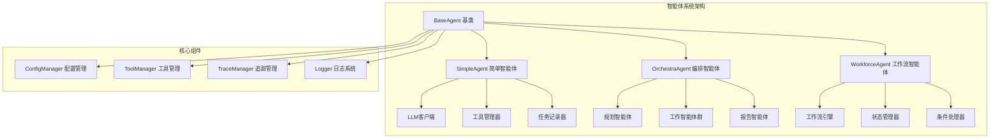
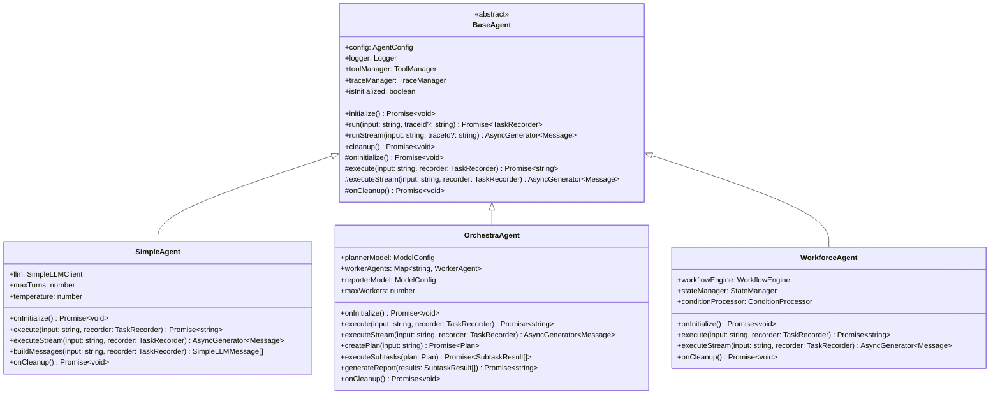
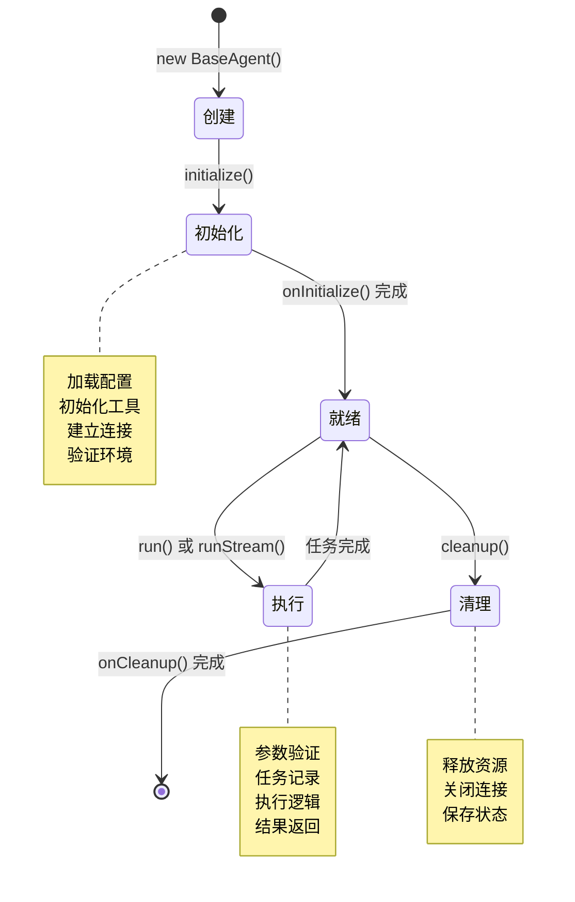
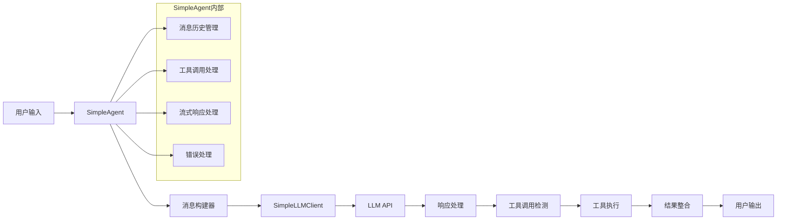
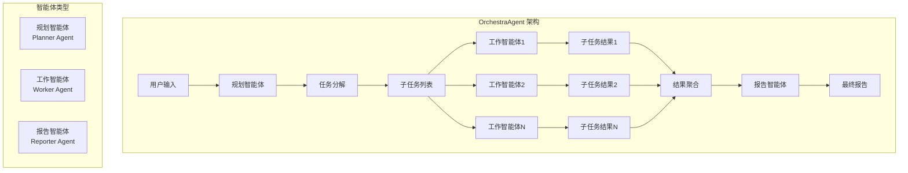
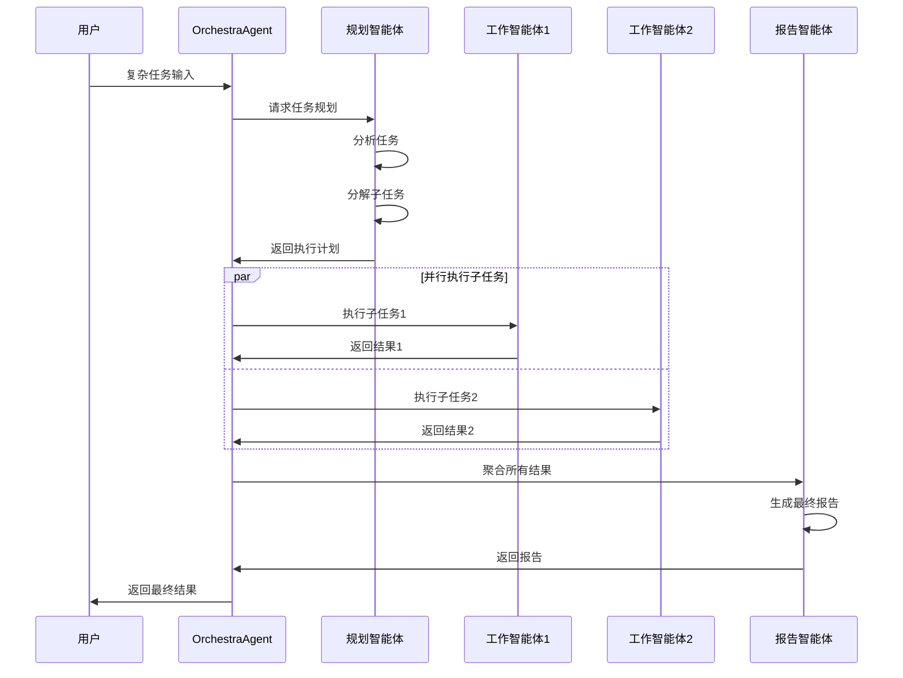
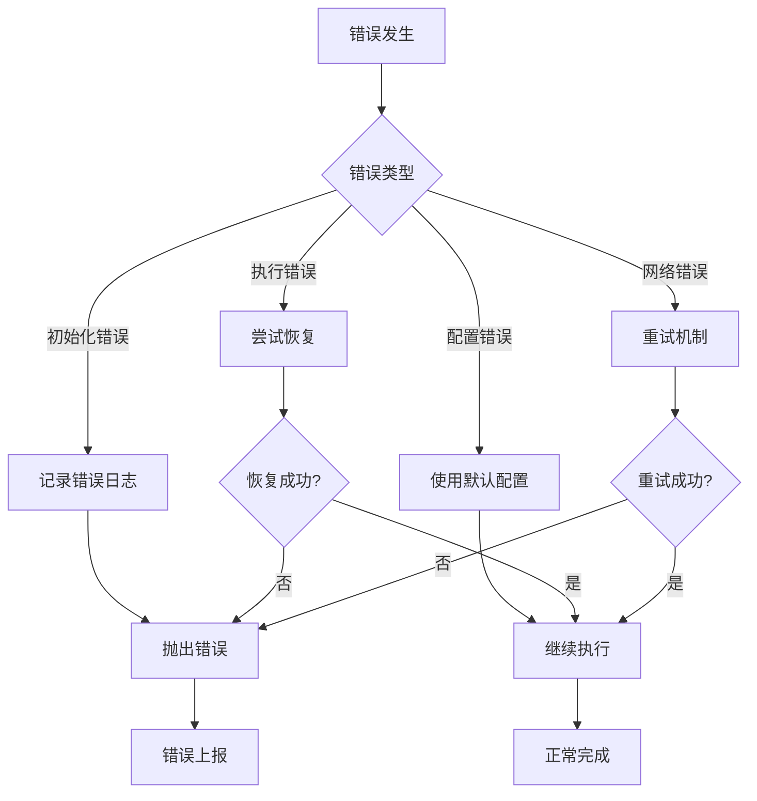

# youtu-agent-ts 核心智能体系统详解

## 概述

youtu-agent-ts的核心智能体系统是整个框架的基础，提供了多种类型的智能体实现，支持从简单的单轮对话到复杂的多智能体协作。本文档深入解析智能体系统的设计原理、实现细节和使用方法。

## 智能体架构设计

### 整体架构图



### 智能体类型层次结构



## BaseAgent 基类详解

### 设计原理

BaseAgent是所有智能体的抽象基类，定义了智能体的通用接口和生命周期管理。它采用了模板方法模式，为子类提供了标准化的执行流程，同时允许子类实现特定的业务逻辑。

### 核心属性

```typescript
export abstract class BaseAgent {
  // 智能体配置
  protected readonly config: AgentConfig;
  
  // 日志记录器
  protected readonly logger: Logger;
  
  // 工具管理器
  protected readonly toolManager: ToolManager;
  
  // 追踪管理器
  protected readonly traceManager: TraceManager;
  
  // 初始化状态
  protected isInitialized: boolean = false;
}
```

### 生命周期管理

智能体的生命周期包含四个关键阶段：



### 核心方法实现

#### 初始化方法

```typescript
protected async initialize(): Promise<void> {
  if (this.isInitialized) {
    return;
  }
  
  try {
    this.logger.info('正在初始化智能体...');
    
    // 加载工具
    if (this.config.tools && this.config.tools.length > 0) {
      // 工具加载逻辑
    }
    
    // 执行子类特定的初始化
    await this.onInitialize();
    
    this.isInitialized = true;
    this.logger.info('智能体初始化完成');
  } catch (error) {
    this.logger.error('智能体初始化失败:', error);
    throw error;
  }
}
```

#### 任务执行方法

```typescript
async run(input: string, traceId?: string): Promise<TaskRecorder> {
  if (!this.isInitialized) {
    await this.initialize();
  }
  
  const recorder = new TaskRecorder(input, traceId);
  
  try {
    this.logger.info(`开始执行任务: ${input}`);
    recorder.start();
    
    // 记录追踪事件
    this.traceManager.recordEvent(recorder.traceId, 'agent_start', {
      agentType: this.config.type,
      agentName: this.config.name,
      input
    });
    
    // 执行具体任务
    const output = await this.execute(input, recorder);
    recorder.complete(output);
    
    // 记录完成事件
    this.traceManager.recordEvent(recorder.traceId, 'agent_end', {
      output,
      duration: recorder.duration
    });
    
    this.logger.info('任务执行完成');
    return recorder;
  } catch (error) {
    recorder.fail(error);
    this.logger.error('任务执行失败:', error);
    throw error;
  }
}
```

## SimpleAgent 简单智能体

### 设计特点

SimpleAgent是基于LangChain实现的单轮对话智能体，支持工具调用和流式响应。它采用了现代异步编程模式，提供了高性能的对话体验。

### 核心组件



### LLM客户端集成

SimpleAgent使用SimpleLLMClient与各种LLM提供商进行交互：

```typescript
export class SimpleAgent extends BaseAgent {
  private llm: SimpleLLMClient;
  
  protected async onInitialize(): Promise<void> {
    // 验证API密钥
    if (!this.config.model.apiKey) {
      throw new Error('API密钥未配置');
    }
    
    // 创建LLM客户端
    this.llm = new SimpleLLMClient({
      provider: this.config.model.provider,
      model: this.config.model.model,
      apiKey: this.config.model.apiKey,
      baseUrl: this.config.model.baseUrl,
      temperature: this.config.temperature || 0.7,
      maxTokens: this.config.maxTokens || 1000,
      timeout: this.config.model.timeout || 30000
    });
    
    // 测试连接
    try {
      await this.llm.testConnection();
      this.logger.info('LLM连接测试成功');
    } catch (error) {
      this.logger.error('LLM连接测试失败:', error);
      throw error;
    }
  }
}
```

### 消息构建机制

SimpleAgent使用智能的消息构建机制，确保与LLM的有效通信：

```typescript
private buildMessages(input: string, recorder: TaskRecorder): SimpleLLMMessage[] {
  const messages: SimpleLLMMessage[] = [];
  
  // 系统提示
  if (this.config.instructions) {
    messages.push({
      role: 'system',
      content: this.config.instructions
    });
  }
  
  // 历史消息
  for (const message of recorder.messages) {
    messages.push({
      role: message.role,
      content: message.content
    });
  }
  
  // 当前用户输入
  messages.push({
    role: 'user',
    content: input
  });
  
  return messages;
}
```

### 流式响应处理

SimpleAgent支持流式响应，提供实时的对话体验：

```typescript
protected async* executeStream(input: string, recorder: TaskRecorder): AsyncGenerator<Message> {
  const messages = this.buildMessages(input, recorder);
  
  try {
    for await (const chunk of this.llm.invokeStream(messages)) {
      const message: Message = {
        role: 'assistant',
        content: chunk.content,
        timestamp: new Date()
      };
      
      recorder.addMessage(message);
      yield message;
    }
  } catch (error) {
    this.logger.error('流式响应失败:', error);
    throw error;
  }
}
```

## OrchestraAgent 编排智能体

### 设计理念

OrchestraAgent实现了多智能体协作编排，能够将复杂任务分解为多个子任务，并协调多个专业智能体协同完成。它采用了分布式任务处理模式，提高了处理复杂任务的能力。

### 架构设计



### 任务分解流程



### 核心实现

#### 任务规划

```typescript
private async createPlan(input: string): Promise<Plan> {
  const plannerMessages: SimpleLLMMessage[] = [
    {
      role: 'system',
      content: `你是一个任务规划专家。请将用户的任务分解为多个可并行执行的子任务。
每个子任务应该：
1. 目标明确
2. 可独立执行
3. 有明确的输入输出
4. 适合分配给专业的工作智能体

请以JSON格式返回规划结果。`
    },
    {
      role: 'user',
      content: input
    }
  ];
  
  const response = await this.plannerLLM.invoke(plannerMessages);
  const plan = JSON.parse(response.content);
  
  // 记录规划事件
  this.traceManager.recordEvent(this.traceId, 'plan_created', { plan });
  
  return plan;
}
```

#### 子任务执行

```typescript
private async executeSubtasks(plan: Plan): Promise<SubtaskResult[]> {
  const results: SubtaskResult[] = [];
  const maxConcurrent = Math.min(this.maxWorkers, plan.subtasks.length);
  
  // 使用信号量控制并发数
  const semaphore = new Semaphore(maxConcurrent);
  
  const tasks = plan.subtasks.map(async (subtask) => {
    return semaphore.acquire(async () => {
      try {
        // 记录子任务开始
        this.traceManager.recordEvent(this.traceId, 'subtask_start', { subtask });
        
        // 选择合适的工作智能体
        const worker = this.selectWorker(subtask);
        
        // 执行子任务
        const result = await worker.execute(subtask.description);
        
        // 记录子任务完成
        this.traceManager.recordEvent(this.traceId, 'subtask_complete', {
          subtask,
          result,
          worker: worker.name
        });
        
        return {
          subtask,
          result,
          worker: worker.name,
          success: true
        };
      } catch (error) {
        this.logger.error(`子任务执行失败: ${subtask.id}`, error);
        return {
          subtask,
          result: null,
          worker: null,
          success: false,
          error: error.message
        };
      }
    });
  });
  
  const taskResults = await Promise.all(tasks);
  results.push(...taskResults);
  
  return results;
}
```

#### 结果聚合

```typescript
private async generateReport(results: SubtaskResult[]): Promise<string> {
  const reporterMessages: SimpleLLMMessage[] = [
    {
      role: 'system',
      content: `你是一个专业的报告生成专家。请根据子任务的执行结果生成一份综合报告。
报告应该：
1. 总结所有子任务的执行情况
2. 突出关键发现和结果
3. 提供清晰的结论和建议
4. 格式清晰，易于理解`
    },
    {
      role: 'user',
      content: `请根据以下子任务结果生成报告：\n${JSON.stringify(results, null, 2)}`
    }
  ];
  
  const response = await this.reporterLLM.invoke(reporterMessages);
  
  // 记录报告生成事件
  this.traceManager.recordEvent(this.traceId, 'report_generated', {
    resultsCount: results.length,
    successCount: results.filter(r => r.success).length
  });
  
  return response.content;
}
```

## 智能体工厂模式

### 设计原理

AgentFactory采用工厂模式，负责根据配置创建不同类型的智能体实例。它提供了统一的创建接口，隐藏了具体智能体的创建细节。

### 工厂实现

```typescript
export class AgentFactory {
  private static agents: Map<string, BaseAgent> = new Map();
  
  static async createAgent(config: AgentConfig): Promise<BaseAgent> {
    const key = `${config.type}:${config.name}`;
    
    // 检查是否已存在
    if (this.agents.has(key)) {
      return this.agents.get(key)!;
    }
    
    let agent: BaseAgent;
    
    switch (config.type) {
      case 'simple':
        agent = new SimpleAgent(config);
        break;
      case 'orchestra':
        agent = new OrchestraAgent(config);
        break;
      case 'workforce':
        agent = new WorkforceAgent(config);
        break;
      default:
        throw new Error(`不支持的智能体类型: ${config.type}`);
    }
    
    // 初始化智能体
    await agent.initialize();
    
    // 缓存智能体实例
    this.agents.set(key, agent);
    
    return agent;
  }
  
  static getAgent(type: string, name: string): BaseAgent | undefined {
    return this.agents.get(`${type}:${name}`);
  }
  
  static getAllAgents(): BaseAgent[] {
    return Array.from(this.agents.values());
  }
  
  static async cleanup(): Promise<void> {
    const cleanupPromises = Array.from(this.agents.values()).map(agent => 
      agent.cleanup()
    );
    
    await Promise.all(cleanupPromises);
    this.agents.clear();
  }
}
```

## 错误处理和恢复

### 错误类型定义

```typescript
export class AgentError extends Error {
  constructor(
    message: string,
    public readonly agentType: string,
    public readonly agentName: string,
    public readonly originalError?: Error
  ) {
    super(message);
    this.name = 'AgentError';
  }
}

export class InitializationError extends AgentError {
  constructor(message: string, agentType: string, agentName: string, originalError?: Error) {
    super(message, agentType, agentName, originalError);
    this.name = 'InitializationError';
  }
}

export class ExecutionError extends AgentError {
  constructor(message: string, agentType: string, agentName: string, originalError?: Error) {
    super(message, agentType, agentName, originalError);
    this.name = 'ExecutionError';
  }
}
```

### 错误处理策略



## 性能优化

### 内存管理

```typescript
export class BaseAgent {
  private messageHistory: Message[] = [];
  private readonly maxHistorySize: number = 100;
  
  protected addMessage(message: Message): void {
    this.messageHistory.push(message);
    
    // 限制历史消息数量
    if (this.messageHistory.length > this.maxHistorySize) {
      this.messageHistory = this.messageHistory.slice(-this.maxHistorySize);
    }
  }
  
  protected async onCleanup(): Promise<void> {
    // 清理消息历史
    this.messageHistory = [];
    
    // 清理其他资源
    // ...
  }
}
```

### 并发控制

```typescript
export class OrchestraAgent extends BaseAgent {
  private readonly maxConcurrentTasks: number = 5;
  private readonly taskQueue: Task[] = [];
  private readonly activeTasks: Set<string> = new Set();
  
  private async executeWithConcurrencyControl(task: Task): Promise<TaskResult> {
    // 等待可用槽位
    while (this.activeTasks.size >= this.maxConcurrentTasks) {
      await new Promise(resolve => setTimeout(resolve, 100));
    }
    
    this.activeTasks.add(task.id);
    
    try {
      const result = await this.executeTask(task);
      return result;
    } finally {
      this.activeTasks.delete(task.id);
    }
  }
}
```

## 最佳实践

### 1. 智能体配置

```yaml
# 推荐的智能体配置
type: simple
name: "my_agent"
model:
  provider: openai
  model: "gpt-3.5-turbo"
  apiKey: "${OPENAI_API_KEY}"
  temperature: 0.7
  maxTokens: 1000
  timeout: 30000
tools:
  - "file_read"
  - "file_write"
  - "web_search"
instructions: |
  你是一个专业的AI助手，请：
  1. 准确理解用户需求
  2. 提供有用的建议和解决方案
  3. 在需要时使用工具获取信息
  4. 保持友好和专业的态度
maxTurns: 10
```

### 2. 错误处理

```typescript
// 推荐的错误处理模式
try {
  const result = await agent.run(input);
  return result;
} catch (error) {
  if (error instanceof InitializationError) {
    // 处理初始化错误
    logger.error('智能体初始化失败', error);
    throw new Error('智能体初始化失败，请检查配置');
  } else if (error instanceof ExecutionError) {
    // 处理执行错误
    logger.error('任务执行失败', error);
    throw new Error('任务执行失败，请稍后重试');
  } else {
    // 处理未知错误
    logger.error('未知错误', error);
    throw new Error('系统错误，请联系管理员');
  }
}
```

### 3. 资源管理

```typescript
// 推荐的资源管理模式
class AgentManager {
  private agents: Map<string, BaseAgent> = new Map();
  
  async createAgent(config: AgentConfig): Promise<BaseAgent> {
    const agent = await AgentFactory.createAgent(config);
    this.agents.set(agent.name, agent);
    return agent;
  }
  
  async cleanup(): Promise<void> {
    const cleanupPromises = Array.from(this.agents.values()).map(agent => 
      agent.cleanup()
    );
    
    await Promise.all(cleanupPromises);
    this.agents.clear();
  }
  
  // 优雅关闭
  async gracefulShutdown(): Promise<void> {
    this.logger.info('开始优雅关闭...');
    
    // 停止接受新任务
    this.acceptingNewTasks = false;
    
    // 等待现有任务完成
    await this.waitForActiveTasks();
    
    // 清理资源
    await this.cleanup();
    
    this.logger.info('优雅关闭完成');
  }
}
```

## 总结

youtu-agent-ts的智能体系统提供了强大而灵活的基础架构，支持从简单对话到复杂协作的各种场景。通过模块化设计和清晰的接口定义，系统具有良好的可扩展性和可维护性。

关键特性包括：
- **类型安全**: 完整的TypeScript类型定义
- **生命周期管理**: 标准化的初始化和清理流程
- **错误处理**: 完善的错误处理和恢复机制
- **性能优化**: 内存管理和并发控制
- **可扩展性**: 支持自定义智能体类型

这个智能体系统为构建复杂的AI应用提供了坚实的基础，能够满足各种业务需求。
