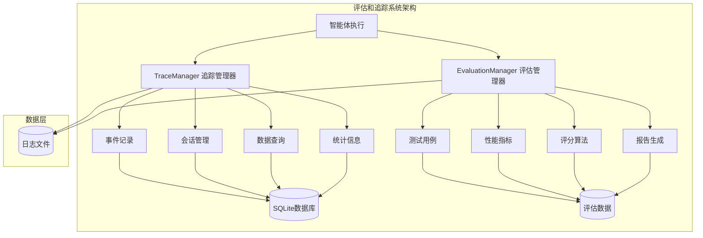
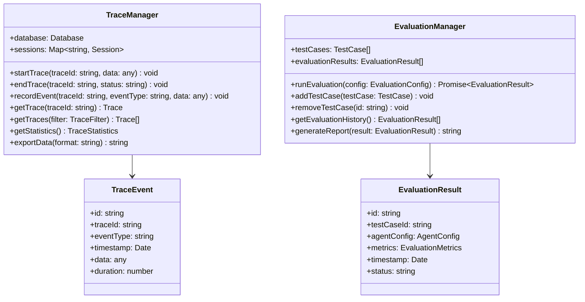
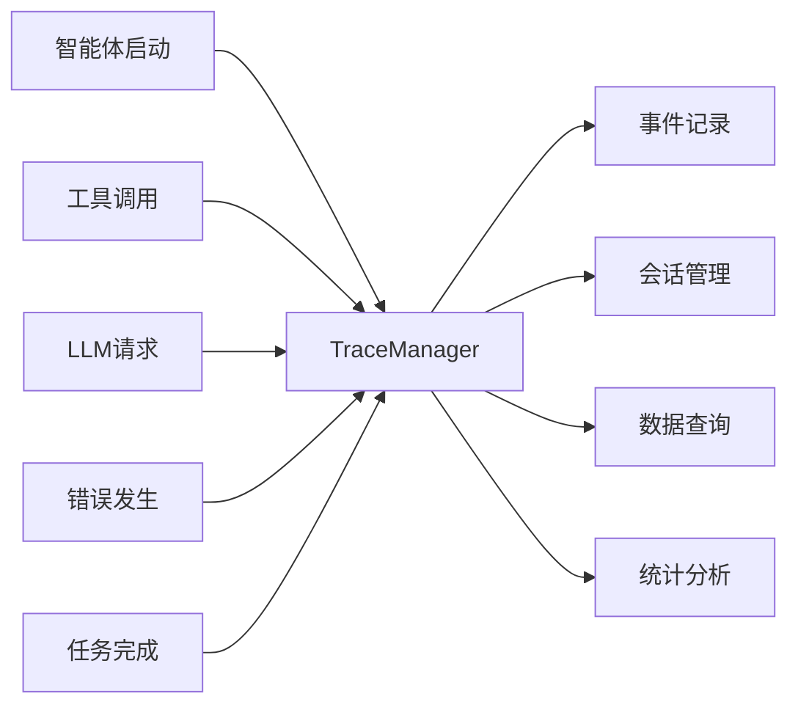
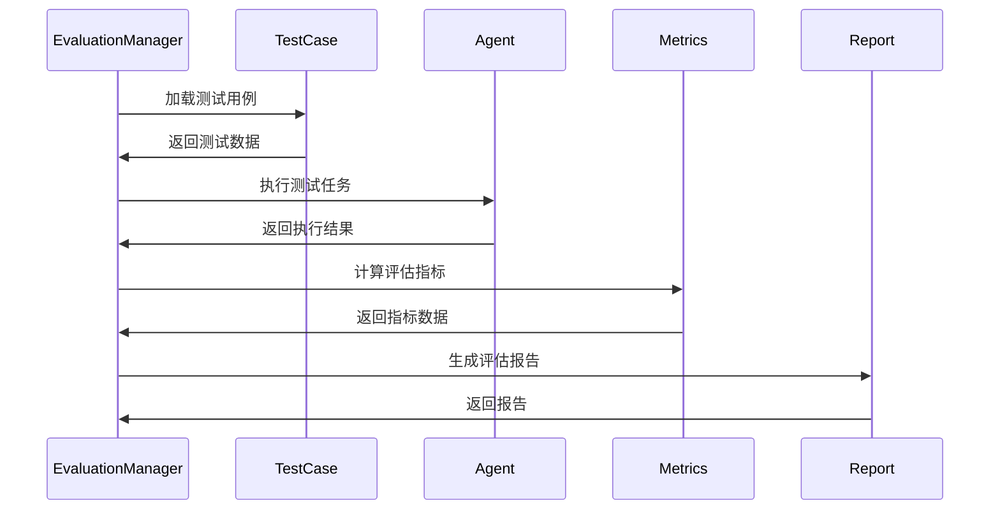

# youtu-agent-ts 评估和追踪系统详解

## 概述

评估和追踪系统是youtu-agent-ts框架的重要组成部分，提供了智能体性能评估、执行过程追踪、监控和日志记录等功能。这些系统帮助开发者了解智能体的表现，优化性能，并确保系统的稳定运行。

## 系统架构

### 整体架构图



### 组件关系图



## TraceManager 追踪系统

### 设计原理

TraceManager负责记录智能体执行过程中的所有事件，提供完整的执行追踪能力。它采用事件驱动架构，能够实时记录和分析智能体的行为。

### 核心功能



### 实现细节

#### 数据库设计

```sql
-- 追踪事件表
CREATE TABLE trace_events (
    id TEXT PRIMARY KEY,
    trace_id TEXT NOT NULL,
    event_type TEXT NOT NULL,
    timestamp DATETIME NOT NULL,
    data TEXT NOT NULL,
    duration INTEGER,
    created_at DATETIME DEFAULT CURRENT_TIMESTAMP
);

-- 会话表
CREATE TABLE sessions (
    id TEXT PRIMARY KEY,
    agent_type TEXT NOT NULL,
    agent_name TEXT NOT NULL,
    start_time DATETIME NOT NULL,
    end_time DATETIME,
    status TEXT NOT NULL,
    metadata TEXT,
    created_at DATETIME DEFAULT CURRENT_TIMESTAMP
);

-- 索引
CREATE INDEX idx_trace_events_trace_id ON trace_events(trace_id);
CREATE INDEX idx_trace_events_event_type ON trace_events(event_type);
CREATE INDEX idx_trace_events_timestamp ON trace_events(timestamp);
CREATE INDEX idx_sessions_agent_type ON sessions(agent_type);
CREATE INDEX idx_sessions_start_time ON sessions(start_time);
```

#### 事件记录

```typescript
export class TraceManager {
  private database: Database;
  private sessions: Map<string, Session> = new Map();
  
  constructor(databasePath: string = './data/traces.db') {
    this.database = new Database(databasePath);
    this.initializeDatabase();
  }
  
  /**
   * 记录追踪事件
   */
  recordEvent(
    traceId: string,
    eventType: 'agent_start' | 'agent_end' | 'tool_call' | 'tool_result' | 'error' | 'plan_created' | 'subtasks_completed' | 'report_generated' | 'subtask_start' | 'subtask_complete' | 'task_recorder',
    data: Record<string, any> = {},
    duration?: number
  ): void {
    const event: TraceEvent = {
      id: this.generateEventId(),
      traceId,
      eventType,
      timestamp: new Date(),
      data,
      duration
    };
    
    // 存储到数据库
    this.storeEvent(event);
    
    // 更新会话信息
    this.updateSession(traceId, event);
    
    // 发出事件通知
    this.emitEvent(event);
  }
  
  /**
   * 存储事件到数据库
   */
  private storeEvent(event: TraceEvent): void {
    const stmt = this.database.prepare(`
      INSERT INTO trace_events (id, trace_id, event_type, timestamp, data, duration)
      VALUES (?, ?, ?, ?, ?, ?)
    `);
    
    stmt.run(
      event.id,
      event.traceId,
      event.eventType,
      event.timestamp.toISOString(),
      JSON.stringify(event.data),
      event.duration
    );
  }
  
  /**
   * 更新会话信息
   */
  private updateSession(traceId: string, event: TraceEvent): void {
    let session = this.sessions.get(traceId);
    
    if (!session) {
      session = {
        id: traceId,
        agentType: event.data.agentType || 'unknown',
        agentName: event.data.agentName || 'unknown',
        startTime: event.timestamp,
        endTime: null,
        status: 'running',
        metadata: {},
        events: []
      };
      
      this.sessions.set(traceId, session);
    }
    
    session.events.push(event);
    
    // 更新会话状态
    if (event.eventType === 'agent_end') {
      session.endTime = event.timestamp;
      session.status = 'completed';
    } else if (event.eventType === 'error') {
      session.status = 'failed';
    }
  }
}
```

#### 数据查询

```typescript
export class TraceManager {
  /**
   * 获取追踪信息
   */
  getTrace(traceId: string): Trace | null {
    const session = this.sessions.get(traceId);
    if (!session) {
      return null;
    }
    
    const events = this.getEventsByTraceId(traceId);
    
    return {
      id: traceId,
      session,
      events,
      duration: this.calculateDuration(events),
      status: session.status
    };
  }
  
  /**
   * 获取事件列表
   */
  getEventsByTraceId(traceId: string): TraceEvent[] {
    const stmt = this.database.prepare(`
      SELECT * FROM trace_events 
      WHERE trace_id = ? 
      ORDER BY timestamp ASC
    `);
    
    const rows = stmt.all(traceId);
    
    return rows.map(row => ({
      id: row.id,
      traceId: row.trace_id,
      eventType: row.event_type,
      timestamp: new Date(row.timestamp),
      data: JSON.parse(row.data),
      duration: row.duration
    }));
  }
  
  /**
   * 查询追踪数据
   */
  getTraces(filter: TraceFilter): Trace[] {
    let query = `
      SELECT DISTINCT trace_id FROM trace_events 
      WHERE 1=1
    `;
    const params: any[] = [];
    
    if (filter.agentType) {
      query += ` AND data LIKE ?`;
      params.push(`%"agentType":"${filter.agentType}"%`);
    }
    
    if (filter.eventType) {
      query += ` AND event_type = ?`;
      params.push(filter.eventType);
    }
    
    if (filter.startTime) {
      query += ` AND timestamp >= ?`;
      params.push(filter.startTime.toISOString());
    }
    
    if (filter.endTime) {
      query += ` AND timestamp <= ?`;
      params.push(filter.endTime.toISOString());
    }
    
    query += ` ORDER BY timestamp DESC LIMIT ?`;
    params.push(filter.limit || 100);
    
    const stmt = this.database.prepare(query);
    const rows = stmt.all(...params);
    
    return rows.map(row => this.getTrace(row.trace_id)).filter(trace => trace !== null) as Trace[];
  }
}
```

#### 统计分析

```typescript
export class TraceManager {
  /**
   * 获取统计信息
   */
  getStatistics(): TraceStatistics {
    const totalEvents = this.getTotalEventCount();
    const totalSessions = this.getTotalSessionCount();
    const eventTypeStats = this.getEventTypeStatistics();
    const agentTypeStats = this.getAgentTypeStatistics();
    const performanceStats = this.getPerformanceStatistics();
    
    return {
      totalEvents,
      totalSessions,
      eventTypeStats,
      agentTypeStats,
      performanceStats,
      generatedAt: new Date()
    };
  }
  
  /**
   * 获取事件类型统计
   */
  private getEventTypeStatistics(): EventTypeStatistics {
    const stmt = this.database.prepare(`
      SELECT event_type, COUNT(*) as count, AVG(duration) as avg_duration
      FROM trace_events 
      WHERE duration IS NOT NULL
      GROUP BY event_type
    `);
    
    const rows = stmt.all();
    
    const stats: EventTypeStatistics = {};
    
    for (const row of rows) {
      stats[row.event_type] = {
        count: row.count,
        averageDuration: row.avg_duration || 0
      };
    }
    
    return stats;
  }
  
  /**
   * 获取性能统计
   */
  private getPerformanceStatistics(): PerformanceStatistics {
    const stmt = this.database.prepare(`
      SELECT 
        AVG(duration) as avg_duration,
        MIN(duration) as min_duration,
        MAX(duration) as max_duration,
        COUNT(*) as total_events
      FROM trace_events 
      WHERE duration IS NOT NULL
    `);
    
    const row = stmt.get();
    
    return {
      averageDuration: row.avg_duration || 0,
      minDuration: row.min_duration || 0,
      maxDuration: row.max_duration || 0,
      totalEvents: row.total_events || 0
    };
  }
}
```

## EvaluationManager 评估系统

### 设计原理

EvaluationManager负责智能体的性能评估，通过标准化的测试用例和评估指标来衡量智能体的表现。它支持多种评估策略和评分算法。

### 评估流程



### 实现细节

#### 测试用例管理

```typescript
export class EvaluationManager {
  private testCases: Map<string, TestCase> = new Map();
  private evaluationResults: Map<string, EvaluationResult> = new Map();
  
  /**
   * 添加测试用例
   */
  addTestCase(testCase: TestCase): void {
    this.validateTestCase(testCase);
    this.testCases.set(testCase.id, testCase);
  }
  
  /**
   * 验证测试用例
   */
  private validateTestCase(testCase: TestCase): void {
    if (!testCase.id || typeof testCase.id !== 'string') {
      throw new Error('测试用例ID必须是非空字符串');
    }
    
    if (!testCase.input || typeof testCase.input !== 'string') {
      throw new Error('测试用例输入必须是非空字符串');
    }
    
    if (!testCase.expectedOutput && !testCase.evaluationCriteria) {
      throw new Error('测试用例必须包含期望输出或评估标准');
    }
  }
  
  /**
   * 运行评估
   */
  async runEvaluation(config: EvaluationConfig): Promise<EvaluationResult> {
    const startTime = Date.now();
    const results: TestResult[] = [];
    
    try {
      // 获取测试用例
      const testCases = this.getTestCases(config.testCaseIds);
      
      // 执行测试
      for (const testCase of testCases) {
        const testResult = await this.executeTestCase(testCase, config.agentConfig);
        results.push(testResult);
      }
      
      // 计算评估指标
      const metrics = this.calculateMetrics(results);
      
      // 生成评估结果
      const evaluationResult: EvaluationResult = {
        id: this.generateEvaluationId(),
        testCaseIds: config.testCaseIds,
        agentConfig: config.agentConfig,
        metrics,
        results,
        timestamp: new Date(),
        status: 'completed',
        duration: Date.now() - startTime
      };
      
      // 存储结果
      this.evaluationResults.set(evaluationResult.id, evaluationResult);
      
      return evaluationResult;
    } catch (error) {
      const evaluationResult: EvaluationResult = {
        id: this.generateEvaluationId(),
        testCaseIds: config.testCaseIds,
        agentConfig: config.agentConfig,
        metrics: null,
        results: [],
        timestamp: new Date(),
        status: 'failed',
        duration: Date.now() - startTime,
        error: error.message
      };
      
      throw evaluationResult;
    }
  }
}
```

#### 测试执行

```typescript
export class EvaluationManager {
  /**
   * 执行单个测试用例
   */
  private async executeTestCase(testCase: TestCase, agentConfig: AgentConfig): Promise<TestResult> {
    const startTime = Date.now();
    
    try {
      // 创建智能体
      const agent = await AgentFactory.createAgent(agentConfig);
      
      // 执行任务
      const result = await agent.run(testCase.input);
      
      const duration = Date.now() - startTime;
      
      // 评估结果
      const score = await this.evaluateResult(testCase, result.output);
      
      return {
        testCaseId: testCase.id,
        input: testCase.input,
        expectedOutput: testCase.expectedOutput,
        actualOutput: result.output,
        score,
        duration,
        success: score >= testCase.minScore,
        metrics: {
          tokenUsage: result.usage || {},
          toolCalls: result.toolCalls || [],
          errorCount: result.errors?.length || 0
        }
      };
    } catch (error) {
      return {
        testCaseId: testCase.id,
        input: testCase.input,
        expectedOutput: testCase.expectedOutput,
        actualOutput: null,
        score: 0,
        duration: Date.now() - startTime,
        success: false,
        error: error.message,
        metrics: {
          tokenUsage: {},
          toolCalls: [],
          errorCount: 1
        }
      };
    }
  }
  
  /**
   * 评估结果
   */
  private async evaluateResult(testCase: TestCase, actualOutput: string): Promise<number> {
    if (testCase.expectedOutput) {
      return this.evaluateByExpectedOutput(testCase.expectedOutput, actualOutput);
    } else if (testCase.evaluationCriteria) {
      return this.evaluateByCriteria(testCase.evaluationCriteria, actualOutput);
    } else {
      throw new Error('无法评估结果：缺少评估标准');
    }
  }
  
  /**
   * 基于期望输出评估
   */
  private evaluateByExpectedOutput(expectedOutput: string, actualOutput: string): number {
    // 使用相似度算法计算得分
    const similarity = this.calculateSimilarity(expectedOutput, actualOutput);
    return Math.round(similarity * 100);
  }
  
  /**
   * 基于评估标准评估
   */
  private async evaluateByCriteria(criteria: EvaluationCriteria, actualOutput: string): Promise<number> {
    let totalScore = 0;
    let criteriaCount = 0;
    
    for (const criterion of criteria) {
      const score = await this.evaluateCriterion(criterion, actualOutput);
      totalScore += score;
      criteriaCount++;
    }
    
    return criteriaCount > 0 ? totalScore / criteriaCount : 0;
  }
}
```

#### 评估指标计算

```typescript
export class EvaluationManager {
  /**
   * 计算评估指标
   */
  private calculateMetrics(results: TestResult[]): EvaluationMetrics {
    const totalTests = results.length;
    const successfulTests = results.filter(r => r.success).length;
    const failedTests = totalTests - successfulTests;
    
    const scores = results.map(r => r.score);
    const durations = results.map(r => r.duration);
    
    const totalTokenUsage = results.reduce((total, r) => {
      return {
        promptTokens: total.promptTokens + (r.metrics.tokenUsage.promptTokens || 0),
        completionTokens: total.completionTokens + (r.metrics.tokenUsage.completionTokens || 0),
        totalTokens: total.totalTokens + (r.metrics.tokenUsage.totalTokens || 0)
      };
    }, { promptTokens: 0, completionTokens: 0, totalTokens: 0 });
    
    return {
      accuracy: totalTests > 0 ? (successfulTests / totalTests) * 100 : 0,
      averageScore: scores.length > 0 ? scores.reduce((a, b) => a + b, 0) / scores.length : 0,
      minScore: scores.length > 0 ? Math.min(...scores) : 0,
      maxScore: scores.length > 0 ? Math.max(...scores) : 0,
      averageDuration: durations.length > 0 ? durations.reduce((a, b) => a + b, 0) / durations.length : 0,
      totalTokenUsage,
      totalToolCalls: results.reduce((total, r) => total + (r.metrics.toolCalls?.length || 0), 0),
      errorRate: totalTests > 0 ? (failedTests / totalTests) * 100 : 0
    };
  }
  
  /**
   * 计算相似度
   */
  private calculateSimilarity(str1: string, str2: string): number {
    // 使用Jaccard相似度算法
    const set1 = new Set(str1.toLowerCase().split(/\s+/));
    const set2 = new Set(str2.toLowerCase().split(/\s+/));
    
    const intersection = new Set([...set1].filter(x => set2.has(x)));
    const union = new Set([...set1, ...set2]);
    
    return intersection.size / union.size;
  }
}
```

#### 报告生成

```typescript
export class EvaluationManager {
  /**
   * 生成评估报告
   */
  generateReport(result: EvaluationResult): string {
    const report = {
      evaluationId: result.id,
      timestamp: result.timestamp,
      agentConfig: {
        type: result.agentConfig.type,
        name: result.agentConfig.name,
        model: result.agentConfig.model
      },
      summary: {
        totalTests: result.results.length,
        successfulTests: result.results.filter(r => r.success).length,
        failedTests: result.results.filter(r => !r.success).length,
        duration: result.duration
      },
      metrics: result.metrics,
      testResults: result.results.map(r => ({
        testCaseId: r.testCaseId,
        success: r.success,
        score: r.score,
        duration: r.duration,
        error: r.error
      })),
      recommendations: this.generateRecommendations(result)
    };
    
    return JSON.stringify(report, null, 2);
  }
  
  /**
   * 生成改进建议
   */
  private generateRecommendations(result: EvaluationResult): string[] {
    const recommendations: string[] = [];
    
    if (result.metrics && result.metrics.accuracy < 80) {
      recommendations.push('准确率较低，建议优化智能体配置或增加训练数据');
    }
    
    if (result.metrics && result.metrics.averageDuration > 10000) {
      recommendations.push('平均执行时间较长，建议优化性能或调整超时设置');
    }
    
    if (result.metrics && result.metrics.errorRate > 10) {
      recommendations.push('错误率较高，建议检查错误处理逻辑');
    }
    
    if (result.metrics && result.metrics.totalTokenUsage.totalTokens > 100000) {
      recommendations.push('Token使用量较高，建议优化提示词或调整模型参数');
    }
    
    return recommendations;
  }
}
```

## 数据导出和可视化

### 数据导出

```typescript
export class DataExporter {
  /**
   * 导出追踪数据
   */
  exportTraces(traces: Trace[], format: 'json' | 'csv'): string {
    switch (format) {
      case 'json':
        return JSON.stringify(traces, null, 2);
      
      case 'csv':
        return this.exportTracesToCSV(traces);
      
      default:
        throw new Error(`不支持的导出格式: ${format}`);
    }
  }
  
  /**
   * 导出评估结果
   */
  exportEvaluationResults(results: EvaluationResult[], format: 'json' | 'csv'): string {
    switch (format) {
      case 'json':
        return JSON.stringify(results, null, 2);
      
      case 'csv':
        return this.exportEvaluationResultsToCSV(results);
      
      default:
        throw new Error(`不支持的导出格式: ${format}`);
    }
  }
  
  /**
   * 导出追踪数据为CSV
   */
  private exportTracesToCSV(traces: Trace[]): string {
    const headers = ['Trace ID', 'Agent Type', 'Agent Name', 'Start Time', 'End Time', 'Duration', 'Status', 'Event Count'];
    const rows = traces.map(trace => [
      trace.id,
      trace.session.agentType,
      trace.session.agentName,
      trace.session.startTime.toISOString(),
      trace.session.endTime?.toISOString() || '',
      trace.duration,
      trace.status,
      trace.events.length
    ]);
    
    return [headers, ...rows].map(row => row.join(',')).join('\n');
  }
}
```

### 可视化支持

```typescript
export class VisualizationManager {
  /**
   * 生成性能图表数据
   */
  generatePerformanceChartData(traces: Trace[]): ChartData {
    const data = traces.map(trace => ({
      x: trace.session.startTime,
      y: trace.duration,
      label: `${trace.session.agentType}:${trace.session.agentName}`
    }));
    
    return {
      type: 'line',
      title: '智能体执行时间趋势',
      data: data.sort((a, b) => a.x.getTime() - b.x.getTime())
    };
  }
  
  /**
   * 生成评估结果图表数据
   */
  generateEvaluationChartData(results: EvaluationResult[]): ChartData {
    const data = results.map(result => ({
      x: result.timestamp,
      y: result.metrics?.accuracy || 0,
      label: `${result.agentConfig.type}:${result.agentConfig.name}`
    }));
    
    return {
      type: 'bar',
      title: '智能体准确率对比',
      data: data.sort((a, b) => a.x.getTime() - b.x.getTime())
    };
  }
}
```

## 最佳实践

### 1. 追踪配置

```typescript
// 推荐的追踪配置
export class TraceConfig {
  static createDefaultConfig(): TraceConfig {
    return {
      enableTracing: true,
      databasePath: './data/traces.db',
      maxEventsPerTrace: 1000,
      eventRetentionDays: 30,
      enableRealTimeMonitoring: true,
      logLevel: 'info'
    };
  }
  
  static createProductionConfig(): TraceConfig {
    return {
      enableTracing: true,
      databasePath: '/var/log/youtu-agent/traces.db',
      maxEventsPerTrace: 10000,
      eventRetentionDays: 90,
      enableRealTimeMonitoring: false,
      logLevel: 'warn'
    };
  }
}
```

### 2. 评估配置

```typescript
// 推荐的评估配置
export class EvaluationConfig {
  static createDefaultConfig(): EvaluationConfig {
    return {
      testCaseIds: [],
      agentConfig: null,
      evaluationCriteria: [],
      timeout: 30000,
      maxRetries: 3,
      enableDetailedLogging: true
    };
  }
  
  static createPerformanceConfig(): EvaluationConfig {
    return {
      testCaseIds: [],
      agentConfig: null,
      evaluationCriteria: [
        { type: 'accuracy', weight: 0.4 },
        { type: 'speed', weight: 0.3 },
        { type: 'resource_usage', weight: 0.3 }
      ],
      timeout: 60000,
      maxRetries: 1,
      enableDetailedLogging: false
    };
  }
}
```

### 3. 监控告警

```typescript
// 推荐的监控告警配置
export class MonitoringAlert {
  static createDefaultAlerts(): AlertConfig[] {
    return [
      {
        name: 'high_error_rate',
        condition: 'error_rate > 10%',
        severity: 'warning',
        action: 'send_notification'
      },
      {
        name: 'slow_performance',
        condition: 'average_duration > 30s',
        severity: 'warning',
        action: 'send_notification'
      },
      {
        name: 'system_failure',
        condition: 'error_rate > 50%',
        severity: 'critical',
        action: 'send_alert'
      }
    ];
  }
}
```

## 总结

youtu-agent-ts的评估和追踪系统提供了完整的智能体监控和评估能力，帮助开发者了解系统性能，优化智能体表现。

关键特性包括：
- **完整追踪**: 记录智能体执行过程中的所有事件
- **性能评估**: 通过标准化测试用例评估智能体表现
- **数据分析**: 提供丰富的统计分析和可视化功能
- **报告生成**: 自动生成详细的评估报告
- **数据导出**: 支持多种格式的数据导出
- **监控告警**: 实时监控和异常告警

这个系统为智能体的持续改进和优化提供了重要的数据支持，是构建高质量AI应用的重要工具。
