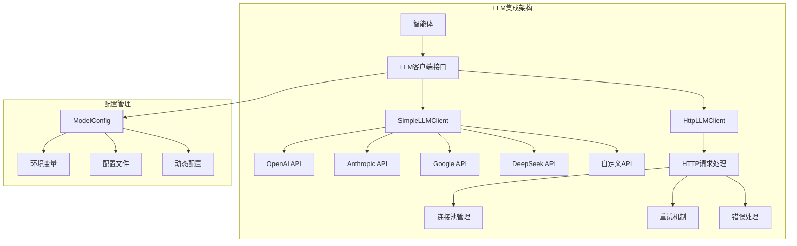
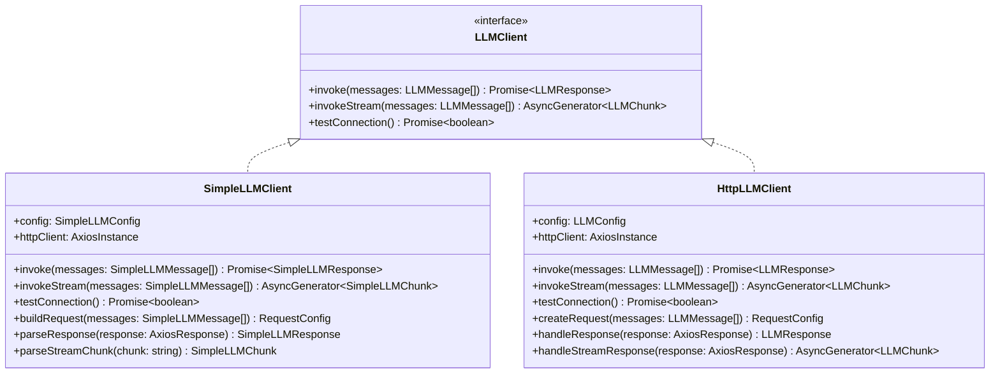
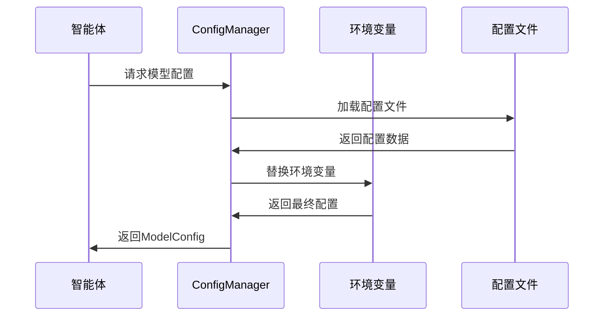
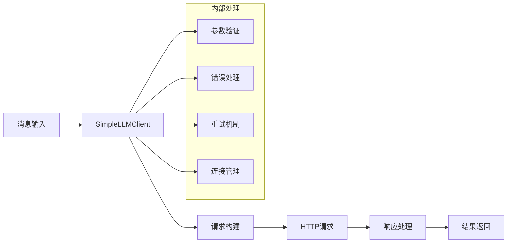
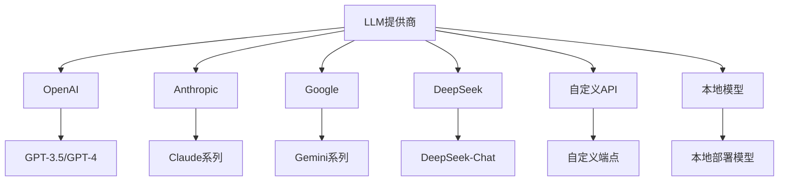
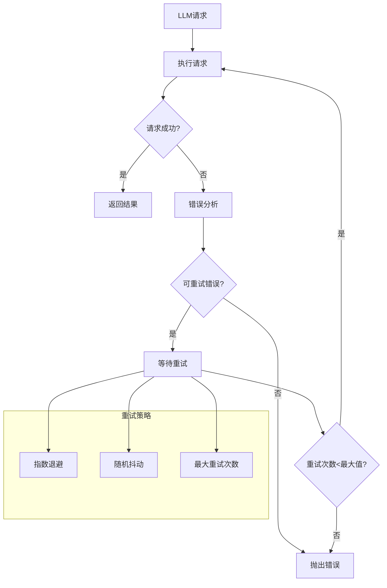

# youtu-agent-ts LLM集成详解

## 概述

LLM（大语言模型）集成是youtu-agent-ts框架的核心组件，负责与各种语言模型提供商进行交互。框架支持多种LLM提供商，包括OpenAI、Anthropic、Google、DeepSeek等，并提供了统一的接口和配置管理。

## LLM集成架构

### 整体架构图



### LLM客户端层次结构



## 配置管理

### 模型配置类型

```typescript
export interface ModelConfig {
  provider: 'openai' | 'anthropic' | 'google' | 'deepseek' | 'local' | 'custom';
  model: string;
  apiKey?: string;
  baseUrl?: string;
  temperature?: number;
  maxTokens?: number;
  timeout?: number;
  retries?: number;
  retryDelay?: number;
}

export interface SimpleLLMConfig {
  provider: 'openai' | 'deepseek' | 'anthropic' | 'google' | 'custom' | 'local';
  model: string;
  apiKey: string;
  baseUrl?: string;
  temperature?: number;
  maxTokens?: number;
  timeout?: number;
}
```

### 配置加载机制



## SimpleLLMClient 详解

### 设计原理

SimpleLLMClient是一个简化的LLM客户端，专门为youtu-agent-ts框架设计。它提供了统一的接口来与各种LLM提供商交互，支持同步和异步调用，以及流式响应。

### 核心功能



### 实现细节

#### 客户端初始化

```typescript
export class SimpleLLMClient {
  private httpClient: AxiosInstance;
  private config: SimpleLLMConfig;
  
  constructor(config: SimpleLLMConfig) {
    this.config = {
      temperature: 0.7,
      maxTokens: 1000,
      timeout: 30000,
      ...config
    };
    
    this.httpClient = this.createHttpClient();
  }
  
  private createHttpClient(): AxiosInstance {
    const client = axios.create({
      timeout: this.config.timeout,
      headers: {
        'Content-Type': 'application/json',
        'User-Agent': 'youtu-agent-ts/1.0.0'
      }
    });
    
    // 添加请求拦截器
    client.interceptors.request.use(
      (config) => {
        // 添加认证头
        if (this.config.apiKey) {
          config.headers.Authorization = `Bearer ${this.config.apiKey}`;
        }
        
        // 设置基础URL
        if (this.config.baseUrl) {
          config.baseURL = this.config.baseUrl;
        }
        
        return config;
      },
      (error) => Promise.reject(error)
    );
    
    // 添加响应拦截器
    client.interceptors.response.use(
      (response) => response,
      (error) => this.handleResponseError(error)
    );
    
    return client;
  }
}
```

#### 同步调用实现

```typescript
export class SimpleLLMClient {
  async invoke(messages: SimpleLLMMessage[]): Promise<SimpleLLMResponse> {
    try {
      const requestConfig = this.buildRequest(messages);
      const response = await this.httpClient.request(requestConfig);
      
      return this.parseResponse(response);
    } catch (error) {
      throw new Error(`LLM调用失败: ${error.message}`);
    }
  }
  
  private buildRequest(messages: SimpleLLMMessage[]): AxiosRequestConfig {
    const requestData = {
      model: this.config.model,
      messages: messages.map(msg => ({
        role: msg.role,
        content: msg.content
      })),
      temperature: this.config.temperature,
      max_tokens: this.config.maxTokens,
      stream: false
    };
    
    return {
      method: 'POST',
      url: this.getApiEndpoint(),
      data: requestData
    };
  }
  
  private parseResponse(response: AxiosResponse): SimpleLLMResponse {
    const data = response.data;
    
    if (!data.choices || data.choices.length === 0) {
      throw new Error('LLM响应格式错误：没有返回选择');
    }
    
    const choice = data.choices[0];
    const message = choice.message;
    
    return {
      content: message.content,
      role: message.role,
      finishReason: choice.finish_reason,
      usage: data.usage,
      model: data.model,
      timestamp: new Date()
    };
  }
}
```

#### 流式调用实现

```typescript
export class SimpleLLMClient {
  async* invokeStream(messages: SimpleLLMMessage[]): AsyncGenerator<SimpleLLMChunk> {
    try {
      const requestConfig = this.buildStreamRequest(messages);
      const response = await this.httpClient.request(requestConfig);
      
      for await (const chunk of this.parseStreamResponse(response)) {
        yield chunk;
      }
    } catch (error) {
      throw new Error(`LLM流式调用失败: ${error.message}`);
    }
  }
  
  private buildStreamRequest(messages: SimpleLLMMessage[]): AxiosRequestConfig {
    const requestData = {
      model: this.config.model,
      messages: messages.map(msg => ({
        role: msg.role,
        content: msg.content
      })),
      temperature: this.config.temperature,
      max_tokens: this.config.maxTokens,
      stream: true
    };
    
    return {
      method: 'POST',
      url: this.getApiEndpoint(),
      data: requestData,
      responseType: 'stream'
    };
  }
  
  private async* parseStreamResponse(response: AxiosResponse): AsyncGenerator<SimpleLLMChunk> {
    const stream = response.data;
    
    for await (const chunk of stream) {
      const lines = chunk.toString().split('\n');
      
      for (const line of lines) {
        if (line.startsWith('data: ')) {
          const data = line.slice(6);
          
          if (data === '[DONE]') {
            return;
          }
          
          try {
            const parsed = JSON.parse(data);
            const choice = parsed.choices?.[0];
            
            if (choice?.delta?.content) {
              yield {
                content: choice.delta.content,
                role: choice.delta.role || 'assistant',
                finishReason: choice.finish_reason,
                timestamp: new Date()
              };
            }
          } catch (error) {
            // 忽略解析错误，继续处理下一行
            continue;
          }
        }
      }
    }
  }
}
```

#### 连接测试

```typescript
export class SimpleLLMClient {
  async testConnection(): Promise<boolean> {
    try {
      const testMessages: SimpleLLMMessage[] = [
        {
          role: 'user',
          content: 'Hello, this is a connection test.'
        }
      ];
      
      const response = await this.invoke(testMessages);
      
      return response.content.length > 0;
    } catch (error) {
      this.logger.error('LLM连接测试失败:', error);
      return false;
    }
  }
}
```

## 多提供商支持

### 提供商配置



### 提供商特定实现

#### OpenAI集成

```typescript
export class OpenAIProvider {
  private readonly baseUrl = 'https://api.openai.com/v1';
  private readonly models = {
    'gpt-3.5-turbo': 'gpt-3.5-turbo',
    'gpt-4': 'gpt-4',
    'gpt-4-turbo': 'gpt-4-turbo-preview'
  };
  
  buildRequest(messages: SimpleLLMMessage[], config: SimpleLLMConfig): AxiosRequestConfig {
    return {
      method: 'POST',
      url: `${this.baseUrl}/chat/completions`,
      data: {
        model: config.model,
        messages: messages.map(msg => ({
          role: msg.role,
          content: msg.content
        })),
        temperature: config.temperature,
        max_tokens: config.maxTokens,
        stream: false
      },
      headers: {
        'Authorization': `Bearer ${config.apiKey}`,
        'Content-Type': 'application/json'
      }
    };
  }
  
  parseResponse(response: AxiosResponse): SimpleLLMResponse {
    const data = response.data;
    const choice = data.choices[0];
    
    return {
      content: choice.message.content,
      role: choice.message.role,
      finishReason: choice.finish_reason,
      usage: data.usage,
      model: data.model,
      timestamp: new Date()
    };
  }
}
```

#### DeepSeek集成

```typescript
export class DeepSeekProvider {
  private readonly baseUrl = 'https://api.deepseek.com/v1';
  private readonly models = {
    'deepseek-chat': 'deepseek-chat',
    'deepseek-coder': 'deepseek-coder'
  };
  
  buildRequest(messages: SimpleLLMMessage[], config: SimpleLLMConfig): AxiosRequestConfig {
    return {
      method: 'POST',
      url: `${this.baseUrl}/chat/completions`,
      data: {
        model: config.model,
        messages: messages.map(msg => ({
          role: msg.role,
          content: msg.content
        })),
        temperature: config.temperature,
        max_tokens: config.maxTokens,
        stream: false
      },
      headers: {
        'Authorization': `Bearer ${config.apiKey}`,
        'Content-Type': 'application/json'
      }
    };
  }
  
  parseResponse(response: AxiosResponse): SimpleLLMResponse {
    const data = response.data;
    const choice = data.choices[0];
    
    return {
      content: choice.message.content,
      role: choice.message.role,
      finishReason: choice.finish_reason,
      usage: data.usage,
      model: data.model,
      timestamp: new Date()
    };
  }
}
```

## 错误处理和重试机制

### 错误类型定义

```typescript
export class LLMError extends Error {
  constructor(
    message: string,
    public readonly provider: string,
    public readonly model: string,
    public readonly originalError?: Error
  ) {
    super(message);
    this.name = 'LLMError';
  }
}

export class ConnectionError extends LLMError {
  constructor(message: string, provider: string, model: string, originalError?: Error) {
    super(message, provider, model, originalError);
    this.name = 'ConnectionError';
  }
}

export class RateLimitError extends LLMError {
  constructor(message: string, provider: string, model: string, originalError?: Error) {
    super(message, provider, model, originalError);
    this.name = 'RateLimitError';
  }
}

export class AuthenticationError extends LLMError {
  constructor(message: string, provider: string, model: string, originalError?: Error) {
    super(message, provider, model, originalError);
    this.name = 'AuthenticationError';
  }
}
```

### 重试机制



### 重试实现

```typescript
export class RetryManager {
  private readonly maxRetries: number = 3;
  private readonly baseDelay: number = 1000; // 1秒
  private readonly maxDelay: number = 10000; // 10秒
  
  async executeWithRetry<T>(
    operation: () => Promise<T>,
    context: string
  ): Promise<T> {
    let lastError: Error;
    
    for (let attempt = 0; attempt <= this.maxRetries; attempt++) {
      try {
        return await operation();
      } catch (error) {
        lastError = error;
        
        if (!this.isRetryableError(error) || attempt === this.maxRetries) {
          throw error;
        }
        
        const delay = this.calculateDelay(attempt);
        this.logger.warn(`${context} 失败，${delay}ms后重试 (尝试 ${attempt + 1}/${this.maxRetries + 1})`);
        
        await this.sleep(delay);
      }
    }
    
    throw lastError!;
  }
  
  private isRetryableError(error: Error): boolean {
    if (error instanceof RateLimitError) {
      return true;
    }
    
    if (error instanceof ConnectionError) {
      return true;
    }
    
    // 检查网络错误
    if (error.message.includes('ECONNRESET') || 
        error.message.includes('ETIMEDOUT') ||
        error.message.includes('ENOTFOUND')) {
      return true;
    }
    
    return false;
  }
  
  private calculateDelay(attempt: number): number {
    // 指数退避 + 随机抖动
    const exponentialDelay = this.baseDelay * Math.pow(2, attempt);
    const jitter = Math.random() * 0.1 * exponentialDelay;
    const delay = Math.min(exponentialDelay + jitter, this.maxDelay);
    
    return Math.floor(delay);
  }
  
  private sleep(ms: number): Promise<void> {
    return new Promise(resolve => setTimeout(resolve, ms));
  }
}
```

## 性能优化

### 连接池管理

```typescript
export class ConnectionPoolManager {
  private readonly pools: Map<string, AxiosInstance> = new Map();
  private readonly maxConnections: number = 10;
  private readonly keepAlive: boolean = true;
  
  getConnection(provider: string): AxiosInstance {
    if (!this.pools.has(provider)) {
      this.pools.set(provider, this.createConnection(provider));
    }
    
    return this.pools.get(provider)!;
  }
  
  private createConnection(provider: string): AxiosInstance {
    const httpAgent = new http.Agent({
      keepAlive: this.keepAlive,
      maxSockets: this.maxConnections,
      timeout: 30000
    });
    
    const httpsAgent = new https.Agent({
      keepAlive: this.keepAlive,
      maxSockets: this.maxConnections,
      timeout: 30000
    });
    
    return axios.create({
      httpAgent,
      httpsAgent,
      timeout: 30000,
      maxRedirects: 5,
      validateStatus: (status) => status < 500
    });
  }
  
  async cleanup(): Promise<void> {
    for (const [provider, connection] of this.pools.entries()) {
      try {
        // 关闭连接池
        if (connection.defaults.httpAgent) {
          connection.defaults.httpAgent.destroy();
        }
        if (connection.defaults.httpsAgent) {
          connection.defaults.httpsAgent.destroy();
        }
      } catch (error) {
        this.logger.warn(`清理连接池失败: ${provider}`, error);
      }
    }
    
    this.pools.clear();
  }
}
```

### 请求缓存

```typescript
export class LLMCacheManager {
  private readonly cache: Map<string, CacheEntry> = new Map();
  private readonly maxCacheSize: number = 1000;
  private readonly defaultTTL: number = 300000; // 5分钟
  
  get(key: string): SimpleLLMResponse | null {
    const entry = this.cache.get(key);
    
    if (!entry) {
      return null;
    }
    
    // 检查是否过期
    if (Date.now() > entry.expiresAt) {
      this.cache.delete(key);
      return null;
    }
    
    return entry.data;
  }
  
  set(key: string, data: SimpleLLMResponse, ttl: number = this.defaultTTL): void {
    // 清理过期缓存
    this.cleanupExpired();
    
    // 检查缓存大小
    if (this.cache.size >= this.maxCacheSize) {
      this.evictOldest();
    }
    
    this.cache.set(key, {
      data,
      createdAt: Date.now(),
      expiresAt: Date.now() + ttl
    });
  }
  
  generateKey(messages: SimpleLLMMessage[], config: SimpleLLMConfig): string {
    const content = JSON.stringify({
      messages: messages.map(msg => ({ role: msg.role, content: msg.content })),
      model: config.model,
      temperature: config.temperature,
      maxTokens: config.maxTokens
    });
    
    return crypto.createHash('md5').update(content).digest('hex');
  }
  
  private cleanupExpired(): void {
    const now = Date.now();
    for (const [key, entry] of this.cache.entries()) {
      if (now > entry.expiresAt) {
        this.cache.delete(key);
      }
    }
  }
  
  private evictOldest(): void {
    let oldestKey = '';
    let oldestTime = Date.now();
    
    for (const [key, entry] of this.cache.entries()) {
      if (entry.createdAt < oldestTime) {
        oldestTime = entry.createdAt;
        oldestKey = key;
      }
    }
    
    if (oldestKey) {
      this.cache.delete(oldestKey);
    }
  }
}
```

## 监控和日志

### 性能监控

```typescript
export class LLMMonitor {
  private readonly metrics: Map<string, MetricData> = new Map();
  
  recordRequest(provider: string, model: string, duration: number, success: boolean): void {
    const key = `${provider}:${model}`;
    const metric = this.metrics.get(key) || {
      totalRequests: 0,
      successfulRequests: 0,
      failedRequests: 0,
      totalDuration: 0,
      averageDuration: 0,
      lastRequest: new Date()
    };
    
    metric.totalRequests++;
    metric.totalDuration += duration;
    metric.averageDuration = metric.totalDuration / metric.totalRequests;
    metric.lastRequest = new Date();
    
    if (success) {
      metric.successfulRequests++;
    } else {
      metric.failedRequests++;
    }
    
    this.metrics.set(key, metric);
  }
  
  getMetrics(): Map<string, MetricData> {
    return new Map(this.metrics);
  }
  
  getSuccessRate(provider: string, model: string): number {
    const key = `${provider}:${model}`;
    const metric = this.metrics.get(key);
    
    if (!metric || metric.totalRequests === 0) {
      return 0;
    }
    
    return metric.successfulRequests / metric.totalRequests;
  }
}
```

### 日志记录

```typescript
export class LLMLogger {
  private readonly logger: Logger;
  
  constructor() {
    this.logger = new Logger('LLMClient');
  }
  
  logRequest(provider: string, model: string, messages: SimpleLLMMessage[]): void {
    this.logger.info('LLM请求', {
      provider,
      model,
      messageCount: messages.length,
      totalTokens: this.estimateTokens(messages)
    });
  }
  
  logResponse(provider: string, model: string, response: SimpleLLMResponse, duration: number): void {
    this.logger.info('LLM响应', {
      provider,
      model,
      duration,
      responseLength: response.content.length,
      usage: response.usage,
      finishReason: response.finishReason
    });
  }
  
  logError(provider: string, model: string, error: Error, duration: number): void {
    this.logger.error('LLM错误', {
      provider,
      model,
      error: error.message,
      duration,
      stack: error.stack
    });
  }
  
  private estimateTokens(messages: SimpleLLMMessage[]): number {
    // 简单的token估算（实际应该使用tiktoken等库）
    const text = messages.map(msg => msg.content).join(' ');
    return Math.ceil(text.length / 4);
  }
}
```

## 最佳实践

### 1. 配置管理

```typescript
// 推荐的配置方式
export class LLMConfigManager {
  static createConfig(provider: string, model: string): SimpleLLMConfig {
    const baseConfig = {
      provider: provider as any,
      model,
      temperature: 0.7,
      maxTokens: 1000,
      timeout: 30000
    };
    
    switch (provider) {
      case 'openai':
        return {
          ...baseConfig,
          apiKey: process.env.OPENAI_API_KEY!,
          baseUrl: 'https://api.openai.com/v1'
        };
      
      case 'deepseek':
        return {
          ...baseConfig,
          apiKey: process.env.DEEPSEEK_API_KEY!,
          baseUrl: 'https://api.deepseek.com/v1'
        };
      
      case 'anthropic':
        return {
          ...baseConfig,
          apiKey: process.env.ANTHROPIC_API_KEY!,
          baseUrl: 'https://api.anthropic.com/v1'
        };
      
      default:
        throw new Error(`不支持的提供商: ${provider}`);
    }
  }
}
```

### 2. 错误处理

```typescript
// 推荐的错误处理模式
export class LLMErrorHandler {
  static handleError(error: Error, context: string): never {
    if (error instanceof AuthenticationError) {
      throw new Error(`认证失败: ${error.message}`);
    }
    
    if (error instanceof RateLimitError) {
      throw new Error(`请求频率限制: ${error.message}`);
    }
    
    if (error instanceof ConnectionError) {
      throw new Error(`连接失败: ${error.message}`);
    }
    
    // 记录未知错误
    logger.error(`未知LLM错误: ${context}`, error);
    throw new Error(`LLM调用失败: ${error.message}`);
  }
}
```

### 3. 性能优化

```typescript
// 推荐的性能优化配置
export class LLMOptimizer {
  static optimizeConfig(config: SimpleLLMConfig): SimpleLLMConfig {
    return {
      ...config,
      timeout: Math.max(config.timeout || 30000, 10000), // 最小10秒
      maxTokens: Math.min(config.maxTokens || 1000, 4000), // 最大4K tokens
      temperature: Math.max(0, Math.min(2, config.temperature || 0.7)) // 限制在0-2之间
    };
  }
  
  static createOptimizedClient(config: SimpleLLMConfig): SimpleLLMClient {
    const optimizedConfig = this.optimizeConfig(config);
    const client = new SimpleLLMClient(optimizedConfig);
    
    // 添加性能监控
    const monitor = new LLMMonitor();
    client.addMonitor(monitor);
    
    return client;
  }
}
```

## 总结

youtu-agent-ts的LLM集成系统提供了强大而灵活的语言模型交互能力，支持多种提供商和配置方式。

关键特性包括：
- **多提供商支持**: 支持OpenAI、Anthropic、Google、DeepSeek等主流提供商
- **统一接口**: 提供一致的API接口，简化使用
- **错误处理**: 完善的错误处理和重试机制
- **性能优化**: 连接池管理和请求缓存
- **监控日志**: 完整的性能监控和日志记录
- **配置管理**: 灵活的配置管理和环境变量支持

这个LLM集成系统为智能体提供了可靠的语言模型交互能力，是构建高质量AI应用的重要基础。
