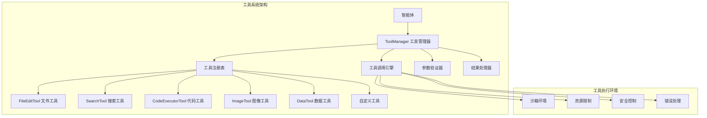
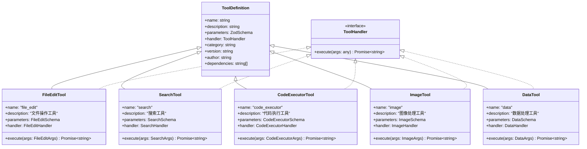
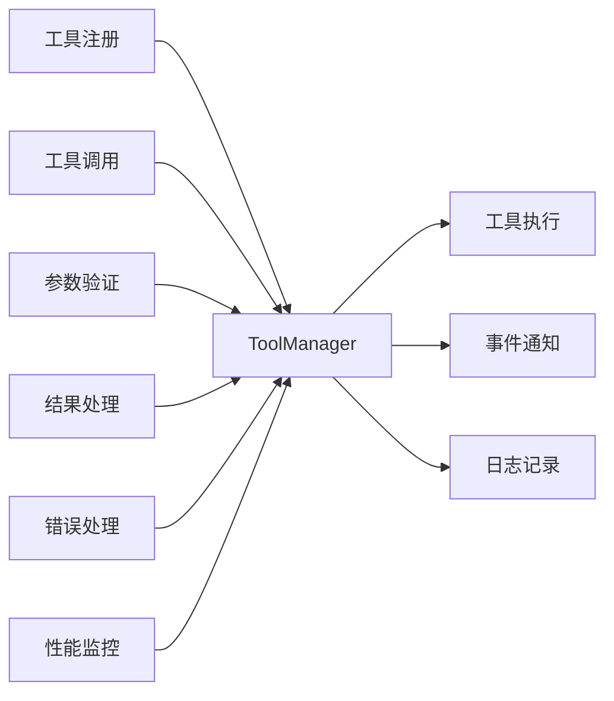
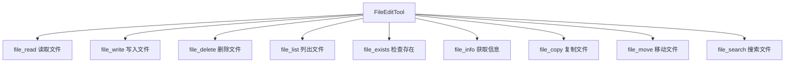
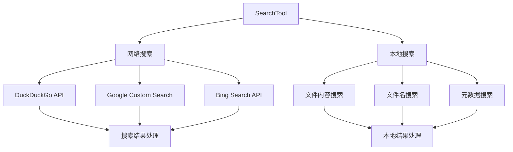
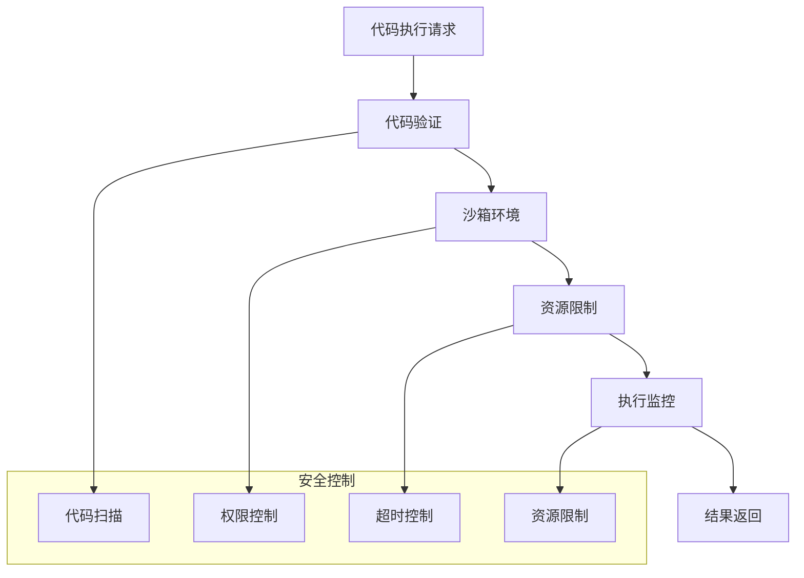
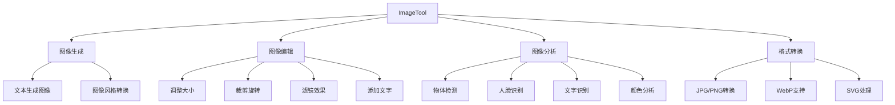
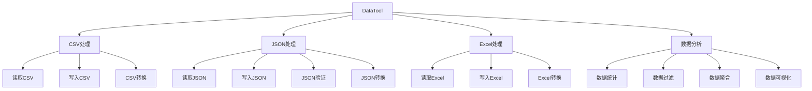
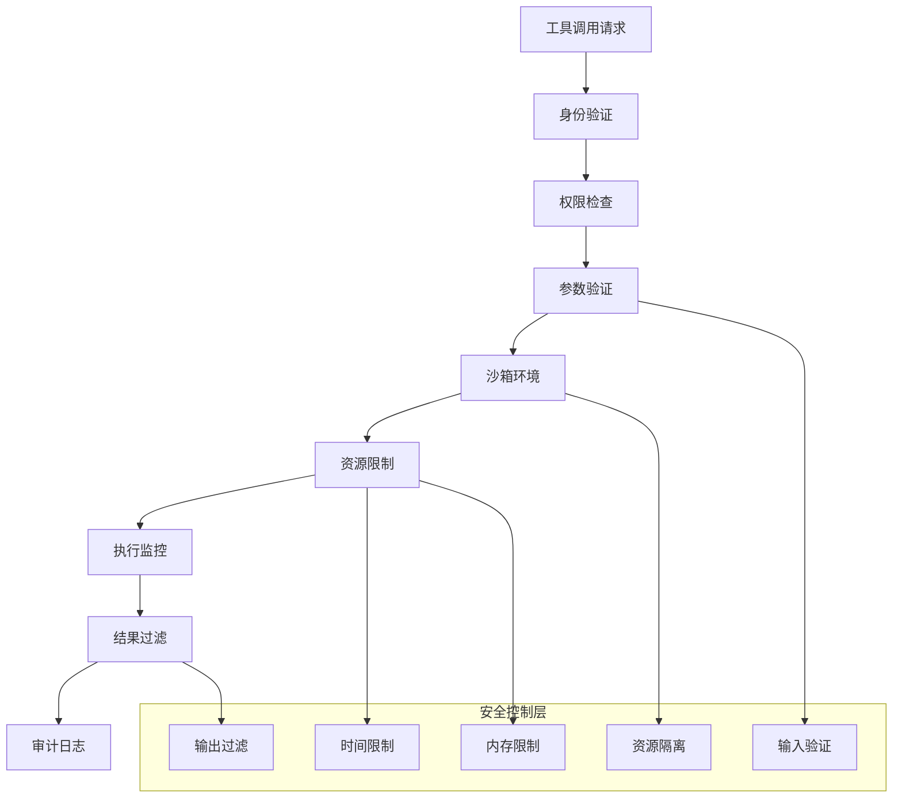

# youtu-agent-ts 工具系统详解

## 概述

工具系统是youtu-agent-ts框架的核心组件之一，为智能体提供了丰富的能力扩展。通过工具系统，智能体可以执行文件操作、网络搜索、代码执行、图像处理等各种任务，大大增强了智能体的实用性和功能范围。

## 工具系统架构

### 整体架构图



### 工具类型层次结构



## ToolManager 工具管理器

### 设计原理

ToolManager是工具系统的核心组件，负责工具的注册、管理、调用和生命周期管理。它采用了注册表模式，提供了统一的工具管理接口。

### 核心功能



### 实现细节

#### 工具注册机制

```typescript
export class ToolManager {
  private tools: Map<string, ToolDefinition> = new Map();
  private eventEmitter: EventEmitter = new EventEmitter();
  
  /**
   * 注册工具
   * @param tool 工具定义
   */
  registerTool(tool: ToolDefinition): void {
    // 验证工具定义
    this.validateToolDefinition(tool);
    
    // 检查工具名称冲突
    if (this.tools.has(tool.name)) {
      throw new Error(`工具名称冲突: ${tool.name}`);
    }
    
    // 注册工具
    this.tools.set(tool.name, tool);
    
    // 发出注册事件
    this.eventEmitter.emit('toolRegistered', tool);
    
    this.logger.info(`工具注册成功: ${tool.name}`);
  }
  
  /**
   * 验证工具定义
   */
  private validateToolDefinition(tool: ToolDefinition): void {
    if (!tool.name || typeof tool.name !== 'string') {
      throw new Error('工具名称必须是非空字符串');
    }
    
    if (!tool.description || typeof tool.description !== 'string') {
      throw new Error('工具描述必须是非空字符串');
    }
    
    if (!tool.parameters || !tool.parameters.parse) {
      throw new Error('工具参数必须是一个有效的ZodSchema');
    }
    
    if (!tool.handler || typeof tool.handler !== 'function') {
      throw new Error('工具处理器必须是一个函数');
    }
  }
}
```

#### 工具调用机制

```typescript
export class ToolManager {
  /**
   * 调用工具
   * @param name 工具名称
   * @param args 工具参数
   * @returns 工具执行结果
   */
  async callTool(name: string, args: any): Promise<string> {
    const tool = this.tools.get(name);
    if (!tool) {
      throw new Error(`工具不存在: ${name}`);
    }
    
    try {
      // 记录调用开始
      this.eventEmitter.emit('toolCallStart', { name, args });
      
      // 验证参数
      const validatedArgs = this.validateToolArgs(tool, args);
      
      // 执行工具
      const startTime = Date.now();
      const result = await tool.handler(validatedArgs);
      const duration = Date.now() - startTime;
      
      // 记录调用完成
      this.eventEmitter.emit('toolCallComplete', { 
        name, 
        args: validatedArgs, 
        result, 
        duration 
      });
      
      return result;
    } catch (error) {
      // 记录调用失败
      this.eventEmitter.emit('toolCallError', { name, args, error });
      throw new Error(`工具调用失败: ${name} - ${error.message}`);
    }
  }
  
  /**
   * 验证工具参数
   */
  private validateToolArgs(tool: ToolDefinition, args: any): any {
    try {
      return tool.parameters.parse(args);
    } catch (error) {
      throw new Error(`参数验证失败: ${error.message}`);
    }
  }
}
```

## 内置工具详解

### FileEditTool 文件编辑工具

#### 功能概述

FileEditTool提供了完整的文件系统操作能力，包括文件读写、创建、删除、列表等操作。它采用了安全的文件操作模式，防止路径遍历攻击。

#### 支持的操作



#### 核心实现

```typescript
export class FileEditTool {
  private readonly maxFileSize: number = 10 * 1024 * 1024; // 10MB
  private readonly allowedExtensions: string[] = ['.txt', '.md', '.json', '.csv', '.yaml', '.yml'];
  private readonly restrictedPaths: string[] = ['/etc', '/usr', '/bin', '/sbin'];
  
  /**
   * 读取文件内容
   */
  async fileRead(args: { filePath: string }): Promise<string> {
    const { filePath } = args;
    
    // 安全验证
    this.validateFilePath(filePath);
    this.checkFileExists(filePath);
    this.checkFileSize(filePath);
    
    try {
      const content = await fs.readFile(filePath, 'utf-8');
      return JSON.stringify({
        success: true,
        content,
        filePath,
        size: content.length
      });
    } catch (error) {
      throw new Error(`文件读取失败: ${error.message}`);
    }
  }
  
  /**
   * 写入文件内容
   */
  async fileWrite(args: { filePath: string; content: string; createDir?: boolean }): Promise<string> {
    const { filePath, content, createDir = false } = args;
    
    // 安全验证
    this.validateFilePath(filePath);
    this.validateFileExtension(filePath);
    
    try {
      // 创建目录（如果需要）
      if (createDir) {
        const dir = path.dirname(filePath);
        await fs.mkdir(dir, { recursive: true });
      }
      
      // 写入文件
      await fs.writeFile(filePath, content, 'utf-8');
      
      return JSON.stringify({
        success: true,
        message: `文件写入成功: ${filePath}`,
        filePath,
        size: content.length
      });
    } catch (error) {
      throw new Error(`文件写入失败: ${error.message}`);
    }
  }
  
  /**
   * 验证文件路径安全性
   */
  private validateFilePath(filePath: string): void {
    // 检查路径遍历
    if (filePath.includes('..') || filePath.includes('~')) {
      throw new Error('不允许的路径遍历');
    }
    
    // 检查限制路径
    const absolutePath = path.resolve(filePath);
    for (const restrictedPath of this.restrictedPaths) {
      if (absolutePath.startsWith(restrictedPath)) {
        throw new Error(`不允许访问系统路径: ${restrictedPath}`);
      }
    }
  }
}
```

### SearchTool 搜索工具

#### 功能概述

SearchTool提供了网络搜索和本地搜索能力，支持多种搜索引擎和搜索策略。

#### 架构设计



#### 核心实现

```typescript
export class SearchTool {
  private readonly searchEngines: Map<string, SearchEngine> = new Map();
  private readonly maxResults: number = 10;
  private readonly timeout: number = 10000;
  
  constructor() {
    this.initializeSearchEngines();
  }
  
  /**
   * 网络搜索
   */
  async webSearch(args: { query: string; engine?: string; maxResults?: number }): Promise<string> {
    const { query, engine = 'duckduckgo', maxResults = this.maxResults } = args;
    
    const searchEngine = this.searchEngines.get(engine);
    if (!searchEngine) {
      throw new Error(`不支持的搜索引擎: ${engine}`);
    }
    
    try {
      const results = await searchEngine.search(query, maxResults);
      
      return JSON.stringify({
        success: true,
        query,
        engine,
        results: results.map(result => ({
          title: result.title,
          url: result.url,
          snippet: result.snippet,
          relevance: result.relevance
        })),
        totalResults: results.length
      });
    } catch (error) {
      throw new Error(`网络搜索失败: ${error.message}`);
    }
  }
  
  /**
   * 本地搜索
   */
  async localSearch(args: { query: string; path: string; type?: 'content' | 'filename' | 'both' }): Promise<string> {
    const { query, path, type = 'both' } = args;
    
    try {
      const results: SearchResult[] = [];
      
      if (type === 'filename' || type === 'both') {
        const filenameResults = await this.searchByFilename(query, path);
        results.push(...filenameResults);
      }
      
      if (type === 'content' || type === 'both') {
        const contentResults = await this.searchByContent(query, path);
        results.push(...contentResults);
      }
      
      return JSON.stringify({
        success: true,
        query,
        path,
        type,
        results: results.map(result => ({
          filePath: result.filePath,
          matchType: result.matchType,
          lineNumber: result.lineNumber,
          context: result.context
        })),
        totalResults: results.length
      });
    } catch (error) {
      throw new Error(`本地搜索失败: ${error.message}`);
    }
  }
  
  /**
   * 按文件名搜索
   */
  private async searchByFilename(query: string, searchPath: string): Promise<SearchResult[]> {
    const results: SearchResult[] = [];
    const regex = new RegExp(query, 'i');
    
    const walkDir = async (dir: string): Promise<void> => {
      const entries = await fs.readdir(dir, { withFileTypes: true });
      
      for (const entry of entries) {
        const fullPath = path.join(dir, entry.name);
        
        if (entry.isDirectory()) {
          await walkDir(fullPath);
        } else if (entry.isFile() && regex.test(entry.name)) {
          results.push({
            filePath: fullPath,
            matchType: 'filename',
            lineNumber: null,
            context: entry.name
          });
        }
      }
    };
    
    await walkDir(searchPath);
    return results;
  }
}
```

### CodeExecutorTool 代码执行工具

#### 功能概述

CodeExecutorTool提供了安全的代码执行环境，支持Python、JavaScript、Shell等多种编程语言。

#### 安全架构



#### 核心实现

```typescript
export class CodeExecutorTool {
  private readonly timeout: number = 30000; // 30秒
  private readonly maxMemory: number = 128 * 1024 * 1024; // 128MB
  private readonly allowedLanguages: string[] = ['python', 'javascript', 'shell'];
  private readonly restrictedModules: string[] = ['os', 'sys', 'subprocess', 'socket'];
  
  /**
   * 执行Python代码
   */
  async pythonExecute(args: { code: string; timeout?: number }): Promise<string> {
    const { code, timeout = this.timeout } = args;
    
    // 代码安全检查
    this.validatePythonCode(code);
    
    try {
      const result = await this.executeInSandbox('python', code, timeout);
      
      return JSON.stringify({
        success: true,
        language: 'python',
        output: result.stdout,
        error: result.stderr,
        executionTime: result.executionTime,
        memoryUsage: result.memoryUsage
      });
    } catch (error) {
      throw new Error(`Python代码执行失败: ${error.message}`);
    }
  }
  
  /**
   * 执行JavaScript代码
   */
  async javascriptExecute(args: { code: string; timeout?: number }): Promise<string> {
    const { code, timeout = this.timeout } = args;
    
    // 代码安全检查
    this.validateJavaScriptCode(code);
    
    try {
      const result = await this.executeInSandbox('node', code, timeout);
      
      return JSON.stringify({
        success: true,
        language: 'javascript',
        output: result.stdout,
        error: result.stderr,
        executionTime: result.executionTime,
        memoryUsage: result.memoryUsage
      });
    } catch (error) {
      throw new Error(`JavaScript代码执行失败: ${error.message}`);
    }
  }
  
  /**
   * 验证Python代码安全性
   */
  private validatePythonCode(code: string): void {
    // 检查危险模块导入
    for (const module of this.restrictedModules) {
      if (code.includes(`import ${module}`) || code.includes(`from ${module}`)) {
        throw new Error(`不允许导入危险模块: ${module}`);
      }
    }
    
    // 检查危险函数调用
    const dangerousFunctions = ['exec', 'eval', 'open', 'file', 'input', 'raw_input'];
    for (const func of dangerousFunctions) {
      if (code.includes(func)) {
        throw new Error(`不允许使用危险函数: ${func}`);
      }
    }
  }
  
  /**
   * 在沙箱环境中执行代码
   */
  private async executeInSandbox(language: string, code: string, timeout: number): Promise<ExecutionResult> {
    const startTime = Date.now();
    
    return new Promise((resolve, reject) => {
      const child = spawn(language, ['-c', code], {
        stdio: ['pipe', 'pipe', 'pipe'],
        timeout,
        maxBuffer: this.maxMemory
      });
      
      let stdout = '';
      let stderr = '';
      
      child.stdout.on('data', (data) => {
        stdout += data.toString();
      });
      
      child.stderr.on('data', (data) => {
        stderr += data.toString();
      });
      
      child.on('close', (code) => {
        const executionTime = Date.now() - startTime;
        
        resolve({
          stdout,
          stderr,
          exitCode: code,
          executionTime,
          memoryUsage: process.memoryUsage().heapUsed
        });
      });
      
      child.on('error', (error) => {
        reject(error);
      });
    });
  }
}
```

### ImageTool 图像处理工具

#### 功能概述

ImageTool提供了完整的图像处理能力，包括图像生成、编辑、分析和格式转换。

#### 功能模块



#### 核心实现

```typescript
export class ImageTool {
  private readonly maxImageSize: number = 10 * 1024 * 1024; // 10MB
  private readonly supportedFormats: string[] = ['jpg', 'jpeg', 'png', 'gif', 'webp', 'svg'];
  private readonly maxDimensions: { width: number; height: number } = { width: 4096, height: 4096 };
  
  /**
   * 调整图像大小
   */
  async resizeImage(args: { 
    imagePath: string; 
    width: number; 
    height: number; 
    maintainAspectRatio?: boolean 
  }): Promise<string> {
    const { imagePath, width, height, maintainAspectRatio = true } = args;
    
    // 验证参数
    this.validateImagePath(imagePath);
    this.validateDimensions(width, height);
    
    try {
      const image = sharp(imagePath);
      const metadata = await image.metadata();
      
      let resizeOptions: any = { width, height };
      
      if (maintainAspectRatio) {
        resizeOptions.fit = 'inside';
        resizeOptions.withoutEnlargement = true;
      }
      
      const resizedImage = await image
        .resize(resizeOptions)
        .jpeg({ quality: 90 })
        .toBuffer();
      
      // 保存调整后的图像
      const outputPath = this.generateOutputPath(imagePath, 'resized');
      await fs.writeFile(outputPath, resizedImage);
      
      return JSON.stringify({
        success: true,
        message: '图像调整大小成功',
        originalPath: imagePath,
        outputPath,
        originalDimensions: { width: metadata.width, height: metadata.height },
        newDimensions: { width, height },
        fileSize: resizedImage.length
      });
    } catch (error) {
      throw new Error(`图像调整大小失败: ${error.message}`);
    }
  }
  
  /**
   * 图像分析
   */
  async analyzeImage(args: { imagePath: string; analysisType: 'colors' | 'objects' | 'text' }): Promise<string> {
    const { imagePath, analysisType } = args;
    
    this.validateImagePath(imagePath);
    
    try {
      const image = sharp(imagePath);
      const metadata = await image.metadata();
      
      let analysisResult: any = {
        metadata: {
          width: metadata.width,
          height: metadata.height,
          format: metadata.format,
          size: metadata.size,
          channels: metadata.channels
        }
      };
      
      switch (analysisType) {
        case 'colors':
          analysisResult.colors = await this.analyzeColors(image);
          break;
        case 'objects':
          analysisResult.objects = await this.detectObjects(image);
          break;
        case 'text':
          analysisResult.text = await this.extractText(image);
          break;
      }
      
      return JSON.stringify({
        success: true,
        imagePath,
        analysisType,
        result: analysisResult
      });
    } catch (error) {
      throw new Error(`图像分析失败: ${error.message}`);
    }
  }
  
  /**
   * 分析图像颜色
   */
  private async analyzeColors(image: sharp.Sharp): Promise<any> {
    const { data, info } = await image
      .resize(100, 100)
      .raw()
      .toBuffer({ resolveWithObject: true });
    
    const colors = new Map<string, number>();
    const totalPixels = data.length / info.channels;
    
    for (let i = 0; i < data.length; i += info.channels) {
      const r = data[i];
      const g = data[i + 1];
      const b = data[i + 2];
      const color = `rgb(${r},${g},${b})`;
      
      colors.set(color, (colors.get(color) || 0) + 1);
    }
    
    // 获取主要颜色
    const dominantColors = Array.from(colors.entries())
      .sort((a, b) => b[1] - a[1])
      .slice(0, 10)
      .map(([color, count]) => ({
        color,
        percentage: (count / totalPixels) * 100
      }));
    
    return {
      dominantColors,
      totalColors: colors.size
    };
  }
}
```

### DataTool 数据处理工具

#### 功能概述

DataTool提供了强大的数据处理能力，支持CSV、JSON、Excel等格式的数据操作和分析。

#### 功能架构



#### 核心实现

```typescript
export class DataTool {
  private readonly maxFileSize: number = 50 * 1024 * 1024; // 50MB
  private readonly maxRows: number = 100000; // 最大行数
  private readonly supportedFormats: string[] = ['csv', 'json', 'xlsx', 'xls'];
  
  /**
   * 读取CSV文件
   */
  async readCsv(args: { filePath: string; delimiter?: string; hasHeader?: boolean }): Promise<string> {
    const { filePath, delimiter = ',', hasHeader = true } = args;
    
    this.validateFilePath(filePath);
    this.validateFileSize(filePath);
    
    try {
      const data: any[] = [];
      const headers: string[] = [];
      
      return new Promise((resolve, reject) => {
        const stream = fs.createReadStream(filePath)
          .pipe(csv({ separator: delimiter }))
          .on('headers', (headerList) => {
            if (hasHeader) {
              headers.push(...headerList);
            }
          })
          .on('data', (row) => {
            if (data.length >= this.maxRows) {
              stream.destroy();
              reject(new Error(`文件行数超过限制: ${this.maxRows}`));
              return;
            }
            data.push(row);
          })
          .on('end', () => {
            const result = {
              success: true,
              filePath,
              totalRows: data.length,
              headers: hasHeader ? headers : null,
              data: data.slice(0, 100), // 只返回前100行
              summary: this.generateDataSummary(data, headers)
            };
            
            resolve(JSON.stringify(result, null, 2));
          })
          .on('error', (error) => {
            reject(new Error(`CSV读取失败: ${error.message}`));
          });
      });
    } catch (error) {
      throw new Error(`CSV文件读取失败: ${error.message}`);
    }
  }
  
  /**
   * 数据分析
   */
  async analyzeData(args: { 
    filePath: string; 
    analysisType: 'summary' | 'correlation' | 'trend' | 'outliers' 
  }): Promise<string> {
    const { filePath, analysisType } = args;
    
    this.validateFilePath(filePath);
    
    try {
      const data = await this.loadData(filePath);
      let analysisResult: any = {};
      
      switch (analysisType) {
        case 'summary':
          analysisResult = this.generateDataSummary(data);
          break;
        case 'correlation':
          analysisResult = this.calculateCorrelations(data);
          break;
        case 'trend':
          analysisResult = this.analyzeTrends(data);
          break;
        case 'outliers':
          analysisResult = this.detectOutliers(data);
          break;
      }
      
      return JSON.stringify({
        success: true,
        filePath,
        analysisType,
        result: analysisResult
      });
    } catch (error) {
      throw new Error(`数据分析失败: ${error.message}`);
    }
  }
  
  /**
   * 生成数据摘要
   */
  private generateDataSummary(data: any[], headers?: string[]): any {
    if (!data || data.length === 0) {
      return { message: '数据为空' };
    }
    
    const summary: any = {
      totalRows: data.length,
      totalColumns: headers ? headers.length : Object.keys(data[0]).length,
      columns: {}
    };
    
    // 分析每列
    const columns = headers || Object.keys(data[0]);
    
    for (const column of columns) {
      const values = data.map(row => row[column]).filter(val => val !== null && val !== undefined);
      
      if (values.length === 0) {
        summary.columns[column] = { type: 'empty', count: 0 };
        continue;
      }
      
      const firstValue = values[0];
      const isNumeric = !isNaN(Number(firstValue)) && isFinite(Number(firstValue));
      
      if (isNumeric) {
        const numericValues = values.map(v => Number(v));
        summary.columns[column] = {
          type: 'numeric',
          count: values.length,
          min: Math.min(...numericValues),
          max: Math.max(...numericValues),
          mean: numericValues.reduce((a, b) => a + b, 0) / numericValues.length,
          median: this.calculateMedian(numericValues)
        };
      } else {
        const uniqueValues = new Set(values);
        summary.columns[column] = {
          type: 'categorical',
          count: values.length,
          uniqueCount: uniqueValues.size,
          mostCommon: this.getMostCommon(values)
        };
      }
    }
    
    return summary;
  }
}
```

## 工具安全机制

### 安全架构



### 安全实现

```typescript
export class ToolSecurityManager {
  private readonly maxExecutionTime: number = 30000; // 30秒
  private readonly maxMemoryUsage: number = 128 * 1024 * 1024; // 128MB
  private readonly allowedOperations: Set<string> = new Set([
    'file_read', 'file_write', 'web_search', 'code_execute'
  ]);
  
  /**
   * 验证工具调用权限
   */
  validateToolCall(toolName: string, args: any, context: SecurityContext): void {
    // 检查工具是否允许
    if (!this.allowedOperations.has(toolName)) {
      throw new Error(`不允许的工具操作: ${toolName}`);
    }
    
    // 检查用户权限
    if (!this.hasPermission(context.userId, toolName)) {
      throw new Error(`用户没有权限执行工具: ${toolName}`);
    }
    
    // 检查参数安全性
    this.validateArgs(toolName, args);
  }
  
  /**
   * 创建安全执行环境
   */
  createSecureEnvironment(): SecureEnvironment {
    return {
      timeout: this.maxExecutionTime,
      memoryLimit: this.maxMemoryUsage,
      networkAccess: false,
      fileSystemAccess: 'restricted',
      processIsolation: true
    };
  }
}
```

## 工具扩展开发

### 自定义工具开发

#### 工具定义模板

```typescript
import { ToolDefinition, ToolHandler } from 'youtu-agent-ts';
import { z } from 'zod';

// 定义参数模式
const MyToolSchema = z.object({
  input: z.string().describe('输入参数'),
  options: z.object({
    timeout: z.number().optional().describe('超时时间'),
    retries: z.number().optional().describe('重试次数')
  }).optional()
});

// 实现工具处理器
const myToolHandler: ToolHandler = async (args) => {
  const { input, options = {} } = args;
  
  try {
    // 实现工具逻辑
    const result = await processInput(input, options);
    
    return JSON.stringify({
      success: true,
      result,
      timestamp: new Date().toISOString()
    });
  } catch (error) {
    throw new Error(`工具执行失败: ${error.message}`);
  }
};

// 创建工具定义
const myTool: ToolDefinition = {
  name: 'my_custom_tool',
  description: '我的自定义工具',
  parameters: MyToolSchema,
  handler: myToolHandler,
  category: 'custom',
  version: '1.0.0',
  author: 'Your Name',
  dependencies: []
};

// 注册工具
toolManager.registerTool(myTool);
```

#### 工具测试

```typescript
describe('MyCustomTool', () => {
  let toolManager: ToolManager;
  
  beforeEach(() => {
    toolManager = new ToolManager();
    toolManager.registerTool(myTool);
  });
  
  it('应该正确执行工具', async () => {
    const args = {
      input: 'test input',
      options: { timeout: 5000 }
    };
    
    const result = await toolManager.callTool('my_custom_tool', args);
    const parsed = JSON.parse(result);
    
    expect(parsed.success).toBe(true);
    expect(parsed.result).toBeDefined();
  });
  
  it('应该处理错误情况', async () => {
    const args = {
      input: 'invalid input'
    };
    
    await expect(toolManager.callTool('my_custom_tool', args))
      .rejects.toThrow('工具执行失败');
  });
});
```

## 性能优化

### 工具缓存机制

```typescript
export class ToolCacheManager {
  private cache: Map<string, CacheEntry> = new Map();
  private readonly maxCacheSize: number = 1000;
  private readonly defaultTTL: number = 300000; // 5分钟
  
  /**
   * 获取缓存结果
   */
  get(key: string): any | null {
    const entry = this.cache.get(key);
    
    if (!entry) {
      return null;
    }
    
    // 检查是否过期
    if (Date.now() > entry.expiresAt) {
      this.cache.delete(key);
      return null;
    }
    
    return entry.data;
  }
  
  /**
   * 设置缓存
   */
  set(key: string, data: any, ttl: number = this.defaultTTL): void {
    // 清理过期缓存
    this.cleanupExpired();
    
    // 检查缓存大小
    if (this.cache.size >= this.maxCacheSize) {
      this.evictOldest();
    }
    
    this.cache.set(key, {
      data,
      createdAt: Date.now(),
      expiresAt: Date.now() + ttl
    });
  }
  
  /**
   * 生成缓存键
   */
  generateKey(toolName: string, args: any): string {
    const argsHash = crypto.createHash('md5')
      .update(JSON.stringify(args))
      .digest('hex');
    
    return `${toolName}:${argsHash}`;
  }
}
```

### 并发控制

```typescript
export class ToolConcurrencyManager {
  private readonly maxConcurrentTools: number = 10;
  private readonly activeTools: Set<string> = new Set();
  private readonly toolQueues: Map<string, ToolRequest[]> = new Map();
  
  /**
   * 执行工具调用
   */
  async executeTool(toolName: string, args: any): Promise<string> {
    // 检查并发限制
    if (this.activeTools.size >= this.maxConcurrentTools) {
      return this.queueToolRequest(toolName, args);
    }
    
    return this.executeToolDirectly(toolName, args);
  }
  
  /**
   * 直接执行工具
   */
  private async executeToolDirectly(toolName: string, args: any): Promise<string> {
    const requestId = this.generateRequestId();
    this.activeTools.add(requestId);
    
    try {
      const result = await this.toolManager.callTool(toolName, args);
      return result;
    } finally {
      this.activeTools.delete(requestId);
      this.processQueuedRequests();
    }
  }
  
  /**
   * 处理队列中的请求
   */
  private processQueuedRequests(): void {
    for (const [toolName, queue] of this.toolQueues.entries()) {
      if (queue.length > 0 && this.activeTools.size < this.maxConcurrentTools) {
        const request = queue.shift();
        if (request) {
          this.executeToolDirectly(toolName, request.args)
            .then(request.resolve)
            .catch(request.reject);
        }
      }
    }
  }
}
```

## 最佳实践

### 1. 工具设计原则

- **单一职责**: 每个工具应该专注于一个特定的功能
- **参数验证**: 使用Zod进行严格的参数验证
- **错误处理**: 提供清晰的错误信息和恢复机制
- **性能考虑**: 优化工具执行性能，避免阻塞
- **安全性**: 实现适当的安全控制和资源限制

### 2. 工具注册最佳实践

```typescript
// 推荐的工具注册方式
export class ToolRegistry {
  private static instance: ToolRegistry;
  private toolManager: ToolManager;
  
  static getInstance(): ToolRegistry {
    if (!ToolRegistry.instance) {
      ToolRegistry.instance = new ToolRegistry();
    }
    return ToolRegistry.instance;
  }
  
  private constructor() {
    this.toolManager = new ToolManager();
    this.registerBuiltinTools();
  }
  
  private registerBuiltinTools(): void {
    // 注册文件工具
    this.toolManager.registerTool(createFileEditTool());
    
    // 注册搜索工具
    this.toolManager.registerTool(createSearchTool());
    
    // 注册代码执行工具
    this.toolManager.registerTool(createCodeExecutorTool());
    
    // 注册图像工具
    this.toolManager.registerTool(createImageTool());
    
    // 注册数据工具
    this.toolManager.registerTool(createDataTool());
  }
  
  getToolManager(): ToolManager {
    return this.toolManager;
  }
}
```

### 3. 错误处理最佳实践

```typescript
// 推荐的错误处理模式
export class ToolErrorHandler {
  static handleToolError(error: Error, toolName: string, args: any): string {
    // 记录错误日志
    logger.error(`工具执行失败: ${toolName}`, {
      error: error.message,
      args,
      stack: error.stack
    });
    
    // 根据错误类型返回适当的响应
    if (error instanceof ValidationError) {
      return JSON.stringify({
        success: false,
        error: '参数验证失败',
        message: error.message,
        toolName
      });
    } else if (error instanceof SecurityError) {
      return JSON.stringify({
        success: false,
        error: '安全验证失败',
        message: '操作被安全策略阻止',
        toolName
      });
    } else {
      return JSON.stringify({
        success: false,
        error: '工具执行失败',
        message: '请稍后重试或联系管理员',
        toolName
      });
    }
  }
}
```

## 总结

youtu-agent-ts的工具系统提供了强大而灵活的能力扩展机制，通过模块化设计和安全控制，为智能体提供了丰富的功能支持。

关键特性包括：
- **模块化设计**: 清晰的工具接口和实现分离
- **安全控制**: 完善的权限验证和资源限制
- **性能优化**: 缓存机制和并发控制
- **扩展性**: 支持自定义工具开发
- **错误处理**: 统一的错误处理和恢复机制

这个工具系统为构建功能丰富的AI应用提供了坚实的基础，能够满足各种复杂的业务需求。
