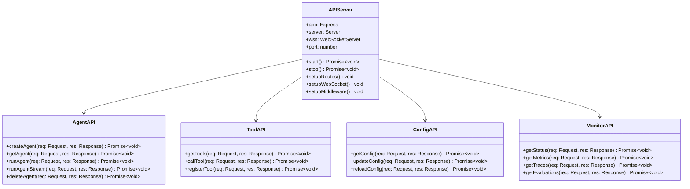
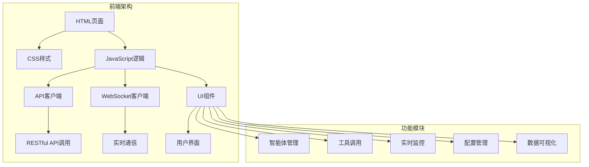

# youtu-agent-ts Web API和前端详解

## 概述

youtu-agent-ts提供了完整的Web API和前端界面，支持RESTful API、WebSocket实时通信、以及现代化的Web控制台。这些组件为智能体提供了便捷的Web访问方式，支持远程调用、实时监控和交互式操作。

## Web API架构

### 整体架构图

```mermaid
graph TB
    subgraph "Web API架构"
        A[客户端] --> B[Express服务器]
        B --> C[RESTful API]
        B --> D[WebSocket服务]
        B --> E[静态文件服务]
        
        C --> F[智能体管理API]
        C --> G[工具管理API]
        C --> H[配置管理API]
        C --> I[监控API]
        
        D --> J[实时通信]
        D --> K[事件推送]
        D --> L[状态同步]
        
        E --> M[前端界面]å
        E --> N[静态资源]
    end
    
    subgraph "中间件层"
        O[身份验证]
        P[请求日志]
        Q[错误处理]
        R[跨域支持]
        S[压缩优化]
    end
    
    B --> O
    B --> P
    B --> Q
    B --> R
    B --> S
```

### API层次结构



## Express服务器实现

### 服务器初始化

```typescript
export class APIServer {
  private app: Express;
  private server: Server;
  private wss: WebSocket.Server;
  private port: number;
  private youtuAgent: YoutuAgentTS;
  
  constructor(port: number = 3000) {
    this.port = port;
    this.app = express();
    this.youtuAgent = new YoutuAgentTS();
    
    this.setupMiddleware();
    this.setupRoutes();
    this.setupWebSocket();
  }
  
  /**
   * 启动服务器
   */
  async start(): Promise<void> {
    try {
      // 初始化框架
      await this.youtuAgent.initialize();
      
      // 启动HTTP服务器
      this.server = this.app.listen(this.port, () => {
        console.log(`🚀 API服务器启动成功: http://localhost:${this.port}`);
        console.log(`📊 监控面板: http://localhost:${this.port}/ui`);
      });
      
      // 启动WebSocket服务器
      this.wss = new WebSocket.Server({ server: this.server });
      this.setupWebSocketHandlers();
      
    } catch (error) {
      console.error('服务器启动失败:', error);
      throw error;
    }
  }
  
  /**
   * 停止服务器
   */
  async stop(): Promise<void> {
    try {
      // 关闭WebSocket连接
      this.wss.close();
      
      // 关闭HTTP服务器
      this.server.close();
      
      // 清理框架资源
      await this.youtuAgent.cleanup();
      
      console.log('服务器已停止');
    } catch (error) {
      console.error('服务器停止失败:', error);
      throw error;
    }
  }
}
```

### 中间件配置

```typescript
export class APIServer {
  /**
   * 设置中间件
   */
  private setupMiddleware(): void {
    // 安全中间件
    this.app.use(helmet());
    
    // 跨域支持
    this.app.use(cors({
      origin: process.env.ALLOWED_ORIGINS?.split(',') || ['http://localhost:3000'],
      credentials: true
    }));
    
    // 请求解析
    this.app.use(express.json({ limit: '10mb' }));
    this.app.use(express.urlencoded({ extended: true, limit: '10mb' }));
    
    // 压缩
    this.app.use(compression());
    
    // 请求日志
    this.app.use(this.requestLogger);
    
    // 错误处理
    this.app.use(this.errorHandler);
  }
  
  /**
   * 请求日志中间件
   */
  private requestLogger = (req: Request, res: Response, next: NextFunction): void => {
    const start = Date.now();
    
    res.on('finish', () => {
      const duration = Date.now() - start;
      console.log(`${req.method} ${req.path} - ${res.statusCode} - ${duration}ms`);
    });
    
    next();
  };
  
  /**
   * 错误处理中间件
   */
  private errorHandler = (error: Error, req: Request, res: Response, next: NextFunction): void => {
    console.error('API错误:', error);
    
    res.status(500).json({
      success: false,
      error: '内部服务器错误',
      message: process.env.NODE_ENV === 'development' ? error.message : '请稍后重试'
    });
  };
}
```

## RESTful API实现

### 智能体管理API

```typescript
export class AgentAPI {
  private youtuAgent: YoutuAgentTS;
  
  constructor(youtuAgent: YoutuAgentTS) {
    this.youtuAgent = youtuAgent;
  }
  
  /**
   * 创建智能体
   * POST /api/agents
   */
  async createAgent(req: Request, res: Response): Promise<void> {
    try {
      const { config } = req.body;
      
      if (!config) {
        res.status(400).json({
          success: false,
          error: '缺少智能体配置'
        });
        return;
      }
      
      const agent = await this.youtuAgent.createAgent(config);
      
      res.status(201).json({
        success: true,
        data: {
          type: agent.config.type,
          name: agent.config.name,
          status: 'created'
        }
      });
    } catch (error) {
      res.status(500).json({
        success: false,
        error: '创建智能体失败',
        message: error.message
      });
    }
  }
  
  /**
   * 获取智能体
   * GET /api/agents/:type/:name
   */
  async getAgent(req: Request, res: Response): Promise<void> {
    try {
      const { type, name } = req.params;
      
      const agent = this.youtuAgent.getAgent(type, name);
      
      if (!agent) {
        res.status(404).json({
          success: false,
          error: '智能体不存在'
        });
        return;
      }
      
      res.json({
        success: true,
        data: {
          type: agent.config.type,
          name: agent.config.name,
          status: agent.isInitialized ? 'ready' : 'initializing',
          config: agent.config
        }
      });
    } catch (error) {
      res.status(500).json({
        success: false,
        error: '获取智能体失败',
        message: error.message
      });
    }
  }
  
  /**
   * 运行智能体
   * POST /api/agents/:type/:name/run
   */
  async runAgent(req: Request, res: Response): Promise<void> {
    try {
      const { type, name } = req.params;
      const { input, traceId } = req.body;
      
      if (!input) {
        res.status(400).json({
          success: false,
          error: '缺少输入内容'
        });
        return;
      }
      
      const agent = this.youtuAgent.getAgent(type, name);
      
      if (!agent) {
        res.status(404).json({
          success: false,
          error: '智能体不存在'
        });
        return;
      }
      
      const result = await agent.run(input, traceId);
      
      res.json({
        success: true,
        data: {
          output: result.output,
          traceId: result.traceId,
          duration: result.duration,
          status: result.status
        }
      });
    } catch (error) {
      res.status(500).json({
        success: false,
        error: '运行智能体失败',
        message: error.message
      });
    }
  }
  
  /**
   * 流式运行智能体
   * POST /api/agents/:type/:name/stream
   */
  async runAgentStream(req: Request, res: Response): Promise<void> {
    try {
      const { type, name } = req.params;
      const { input, traceId } = req.body;
      
      if (!input) {
        res.status(400).json({
          success: false,
          error: '缺少输入内容'
        });
        return;
      }
      
      const agent = this.youtuAgent.getAgent(type, name);
      
      if (!agent) {
        res.status(404).json({
          success: false,
          error: '智能体不存在'
        });
        return;
      }
      
      // 设置SSE响应头
      res.writeHead(200, {
        'Content-Type': 'text/event-stream',
        'Cache-Control': 'no-cache',
        'Connection': 'keep-alive',
        'Access-Control-Allow-Origin': '*',
        'Access-Control-Allow-Headers': 'Cache-Control'
      });
      
      // 流式返回结果
      for await (const message of agent.runStream(input, traceId)) {
        res.write(`data: ${JSON.stringify({
          success: true,
          data: message
        })}\n\n`);
      }
      
      res.write(`data: ${JSON.stringify({
        success: true,
        data: { type: 'end' }
      })}\n\n`);
      
      res.end();
    } catch (error) {
      res.write(`data: ${JSON.stringify({
        success: false,
        error: '流式运行失败',
        message: error.message
      })}\n\n`);
      res.end();
    }
  }
}
```

### 工具管理API

```typescript
export class ToolAPI {
  private toolManager: ToolManager;
  
  constructor(toolManager: ToolManager) {
    this.toolManager = toolManager;
  }
  
  /**
   * 获取工具列表
   * GET /api/tools
   */
  async getTools(req: Request, res: Response): Promise<void> {
    try {
      const tools = this.toolManager.getAllTools();
      
      res.json({
        success: true,
        data: tools.map(tool => ({
          name: tool.name,
          description: tool.description,
          category: tool.category,
          version: tool.version
        }))
      });
    } catch (error) {
      res.status(500).json({
        success: false,
        error: '获取工具列表失败',
        message: error.message
      });
    }
  }
  
  /**
   * 调用工具
   * POST /api/tools/:name/call
   */
  async callTool(req: Request, res: Response): Promise<void> {
    try {
      const { name } = req.params;
      const { args } = req.body;
      
      if (!args) {
        res.status(400).json({
          success: false,
          error: '缺少工具参数'
        });
        return;
      }
      
      const result = await this.toolManager.callTool(name, args);
      
      res.json({
        success: true,
        data: {
          result,
          tool: name,
          timestamp: new Date().toISOString()
        }
      });
    } catch (error) {
      res.status(500).json({
        success: false,
        error: '工具调用失败',
        message: error.message
      });
    }
  }
  
  /**
   * 注册工具
   * POST /api/tools/register
   */
  async registerTool(req: Request, res: Response): Promise<void> {
    try {
      const { tool } = req.body;
      
      if (!tool) {
        res.status(400).json({
          success: false,
          error: '缺少工具定义'
        });
        return;
      }
      
      this.toolManager.registerTool(tool);
      
      res.status(201).json({
        success: true,
        data: {
          name: tool.name,
          status: 'registered'
        }
      });
    } catch (error) {
      res.status(500).json({
        success: false,
        error: '工具注册失败',
        message: error.message
      });
    }
  }
}
```

### 监控API

```typescript
export class MonitorAPI {
  private traceManager: TraceManager;
  private evaluationManager: EvaluationManager;
  
  constructor(traceManager: TraceManager, evaluationManager: EvaluationManager) {
    this.traceManager = traceManager;
    this.evaluationManager = evaluationManager;
  }
  
  /**
   * 获取系统状态
   * GET /api/monitor/status
   */
  async getStatus(req: Request, res: Response): Promise<void> {
    try {
      const status = {
        timestamp: new Date().toISOString(),
        uptime: process.uptime(),
        memory: process.memoryUsage(),
        cpu: process.cpuUsage(),
        agents: this.youtuAgent.getAllAgents().length,
        tools: this.toolManager.getAllTools().length
      };
      
      res.json({
        success: true,
        data: status
      });
    } catch (error) {
      res.status(500).json({
        success: false,
        error: '获取系统状态失败',
        message: error.message
      });
    }
  }
  
  /**
   * 获取追踪数据
   * GET /api/monitor/traces
   */
  async getTraces(req: Request, res: Response): Promise<void> {
    try {
      const { limit = 100, agentType, eventType, startTime, endTime } = req.query;
      
      const filter: TraceFilter = {
        limit: parseInt(limit as string),
        agentType: agentType as string,
        eventType: eventType as string,
        startTime: startTime ? new Date(startTime as string) : undefined,
        endTime: endTime ? new Date(endTime as string) : undefined
      };
      
      const traces = this.traceManager.getTraces(filter);
      
      res.json({
        success: true,
        data: traces
      });
    } catch (error) {
      res.status(500).json({
        success: false,
        error: '获取追踪数据失败',
        message: error.message
      });
    }
  }
  
  /**
   * 获取评估结果
   * GET /api/monitor/evaluations
   */
  async getEvaluations(req: Request, res: Response): Promise<void> {
    try {
      const { limit = 50 } = req.query;
      
      const results = this.evaluationManager.getEvaluationHistory();
      const limitedResults = results.slice(0, parseInt(limit as string));
      
      res.json({
        success: true,
        data: limitedResults
      });
    } catch (error) {
      res.status(500).json({
        success: false,
        error: '获取评估结果失败',
        message: error.message
      });
    }
  }
}
```

## WebSocket实时通信

### WebSocket服务器

```typescript
export class APIServer {
  /**
   * 设置WebSocket处理器
   */
  private setupWebSocketHandlers(): void {
    this.wss.on('connection', (ws: WebSocket) => {
      console.log('WebSocket客户端已连接');
      
      // 发送欢迎消息
      this.sendWebSocketMessage(ws, {
        type: 'welcome',
        message: '连接成功',
        timestamp: new Date().toISOString()
      });
      
      // 处理消息
      ws.on('message', (data: Buffer) => {
        try {
          const message = JSON.parse(data.toString());
          this.handleWebSocketMessage(ws, message);
        } catch (error) {
          this.sendWebSocketMessage(ws, {
            type: 'error',
            message: '消息格式错误',
            timestamp: new Date().toISOString()
          });
        }
      });
      
      // 处理断开连接
      ws.on('close', () => {
        console.log('WebSocket客户端已断开');
      });
      
      // 处理错误
      ws.on('error', (error) => {
        console.error('WebSocket错误:', error);
      });
    });
  }
  
  /**
   * 处理WebSocket消息
   */
  private handleWebSocketMessage(ws: WebSocket, message: any): void {
    switch (message.type) {
      case 'agent_run':
        this.handleAgentRun(ws, message);
        break;
      
      case 'subscribe_traces':
        this.handleSubscribeTraces(ws, message);
        break;
      
      case 'subscribe_metrics':
        this.handleSubscribeMetrics(ws, message);
        break;
      
      default:
        this.sendWebSocketMessage(ws, {
          type: 'error',
          message: `未知消息类型: ${message.type}`,
          timestamp: new Date().toISOString()
        });
    }
  }
  
  /**
   * 处理智能体运行请求
   */
  private async handleAgentRun(ws: WebSocket, message: any): Promise<void> {
    try {
      const { agentType, agentName, input, traceId } = message.data;
      
      const agent = this.youtuAgent.getAgent(agentType, agentName);
      
      if (!agent) {
        this.sendWebSocketMessage(ws, {
          type: 'agent_run_error',
          message: '智能体不存在',
          timestamp: new Date().toISOString()
        });
        return;
      }
      
      // 发送开始消息
      this.sendWebSocketMessage(ws, {
        type: 'agent_run_start',
        data: { traceId },
        timestamp: new Date().toISOString()
      });
      
      // 流式执行
      for await (const chunk of agent.runStream(input, traceId)) {
        this.sendWebSocketMessage(ws, {
          type: 'agent_run_chunk',
          data: chunk,
          timestamp: new Date().toISOString()
        });
      }
      
      // 发送完成消息
      this.sendWebSocketMessage(ws, {
        type: 'agent_run_complete',
        data: { traceId },
        timestamp: new Date().toISOString()
      });
      
    } catch (error) {
      this.sendWebSocketMessage(ws, {
        type: 'agent_run_error',
        message: error.message,
        timestamp: new Date().toISOString()
      });
    }
  }
  
  /**
   * 发送WebSocket消息
   */
  private sendWebSocketMessage(ws: WebSocket, message: any): void {
    if (ws.readyState === WebSocket.OPEN) {
      ws.send(JSON.stringify(message));
    }
  }
}
```

### 实时事件推送

```typescript
export class EventBroadcaster {
  private wss: WebSocket.Server;
  
  constructor(wss: WebSocket.Server) {
    this.wss = wss;
  }
  
  /**
   * 广播事件
   */
  broadcast(event: any): void {
    const message = JSON.stringify({
      type: 'event',
      data: event,
      timestamp: new Date().toISOString()
    });
    
    this.wss.clients.forEach((ws) => {
      if (ws.readyState === WebSocket.OPEN) {
        ws.send(message);
      }
    });
  }
  
  /**
   * 广播追踪事件
   */
  broadcastTraceEvent(event: TraceEvent): void {
    this.broadcast({
      eventType: 'trace',
      traceId: event.traceId,
      eventType: event.eventType,
      data: event.data,
      timestamp: event.timestamp
    });
  }
  
  /**
   * 广播评估结果
   */
  broadcastEvaluationResult(result: EvaluationResult): void {
    this.broadcast({
      eventType: 'evaluation',
      evaluationId: result.id,
      status: result.status,
      metrics: result.metrics,
      timestamp: result.timestamp
    });
  }
}
```

## 前端界面

### 前端架构



### 前端实现

#### HTML结构

```html
<!DOCTYPE html>
<html lang="zh-CN">
<head>
    <meta charset="UTF-8">
    <meta name="viewport" content="width=device-width, initial-scale=1.0">
    <title>youtu-agent-ts 控制台</title>
    <link rel="stylesheet" href="styles.css">
</head>
<body>
    <div class="container">
        <!-- 头部导航 -->
        <header class="header">
            <h1>youtu-agent-ts 控制台</h1>
            <div class="status-indicator">
                <span class="status-dot" id="statusDot"></span>
                <span id="statusText">连接中...</span>
            </div>
        </header>
        
        <!-- 主要内容区域 -->
        <main class="main-content">
            <!-- 侧边栏 -->
            <aside class="sidebar">
                <nav class="nav">
                    <a href="#agents" class="nav-item active" data-tab="agents">智能体管理</a>
                    <a href="#tools" class="nav-item" data-tab="tools">工具管理</a>
                    <a href="#monitor" class="nav-item" data-tab="monitor">实时监控</a>
                    <a href="#config" class="nav-item" data-tab="config">配置管理</a>
                </nav>
            </aside>
            
            <!-- 内容区域 -->
            <div class="content">
                <!-- 智能体管理 -->
                <div id="agents" class="tab-content active">
                    <div class="section">
                        <h2>智能体管理</h2>
                        <div class="controls">
                            <button id="createAgentBtn" class="btn btn-primary">创建智能体</button>
                            <button id="refreshAgentsBtn" class="btn btn-secondary">刷新</button>
                        </div>
                        <div id="agentsList" class="agents-list"></div>
                    </div>
                    
                    <div class="section">
                        <h3>智能体对话</h3>
                        <div class="chat-container">
                            <div id="chatMessages" class="chat-messages"></div>
                            <div class="chat-input">
                                <input type="text" id="chatInput" placeholder="输入消息...">
                                <button id="sendBtn" class="btn btn-primary">发送</button>
                            </div>
                        </div>
                    </div>
                </div>
                
                <!-- 工具管理 -->
                <div id="tools" class="tab-content">
                    <div class="section">
                        <h2>工具管理</h2>
                        <div id="toolsList" class="tools-list"></div>
                    </div>
                </div>
                
                <!-- 实时监控 -->
                <div id="monitor" class="tab-content">
                    <div class="section">
                        <h2>系统状态</h2>
                        <div id="systemStatus" class="status-grid"></div>
                    </div>
                    
                    <div class="section">
                        <h3>实时追踪</h3>
                        <div id="traceEvents" class="trace-events"></div>
                    </div>
                </div>
                
                <!-- 配置管理 -->
                <div id="config" class="tab-content">
                    <div class="section">
                        <h2>配置管理</h2>
                        <div id="configEditor" class="config-editor"></div>
                    </div>
                </div>
            </div>
        </main>
    </div>
    
    <script src="app.js"></script>
</body>
</html>
```

#### JavaScript逻辑

```javascript
class YoutuAgentConsole {
    constructor() {
        this.apiBaseUrl = '/api';
        this.wsUrl = `ws://${window.location.host}`;
        this.ws = null;
        this.currentAgent = null;
        
        this.init();
    }
    
    /**
     * 初始化应用
     */
    init() {
        this.setupEventListeners();
        this.connectWebSocket();
        this.loadInitialData();
    }
    
    /**
     * 设置事件监听器
     */
    setupEventListeners() {
        // 标签页切换
        document.querySelectorAll('.nav-item').forEach(item => {
            item.addEventListener('click', (e) => {
                this.switchTab(e.target.dataset.tab);
            });
        });
        
        // 创建智能体按钮
        document.getElementById('createAgentBtn').addEventListener('click', () => {
            this.showCreateAgentDialog();
        });
        
        // 刷新按钮
        document.getElementById('refreshAgentsBtn').addEventListener('click', () => {
            this.loadAgents();
        });
        
        // 发送消息按钮
        document.getElementById('sendBtn').addEventListener('click', () => {
            this.sendMessage();
        });
        
        // 回车发送消息
        document.getElementById('chatInput').addEventListener('keypress', (e) => {
            if (e.key === 'Enter') {
                this.sendMessage();
            }
        });
    }
    
    /**
     * 连接WebSocket
     */
    connectWebSocket() {
        this.ws = new WebSocket(this.wsUrl);
        
        this.ws.onopen = () => {
            this.updateStatus('已连接', 'connected');
            console.log('WebSocket连接已建立');
        };
        
        this.ws.onmessage = (event) => {
            const message = JSON.parse(event.data);
            this.handleWebSocketMessage(message);
        };
        
        this.ws.onclose = () => {
            this.updateStatus('连接断开', 'disconnected');
            console.log('WebSocket连接已断开');
            
            // 5秒后重连
            setTimeout(() => {
                this.connectWebSocket();
            }, 5000);
        };
        
        this.ws.onerror = (error) => {
            console.error('WebSocket错误:', error);
            this.updateStatus('连接错误', 'error');
        };
    }
    
    /**
     * 处理WebSocket消息
     */
    handleWebSocketMessage(message) {
        switch (message.type) {
            case 'welcome':
                console.log('收到欢迎消息:', message.message);
                break;
                
            case 'agent_run_start':
                this.addChatMessage('system', '智能体开始处理...');
                break;
                
            case 'agent_run_chunk':
                this.addChatMessage('assistant', message.data.content);
                break;
                
            case 'agent_run_complete':
                this.addChatMessage('system', '智能体处理完成');
                break;
                
            case 'agent_run_error':
                this.addChatMessage('error', `错误: ${message.message}`);
                break;
                
            case 'event':
                this.handleEvent(message.data);
                break;
        }
    }
    
    /**
     * 加载初始数据
     */
    async loadInitialData() {
        await this.loadAgents();
        await this.loadTools();
        await this.loadSystemStatus();
    }
    
    /**
     * 加载智能体列表
     */
    async loadAgents() {
        try {
            const response = await fetch(`${this.apiBaseUrl}/agents`);
            const data = await response.json();
            
            if (data.success) {
                this.renderAgents(data.data);
            } else {
                console.error('加载智能体失败:', data.error);
            }
        } catch (error) {
            console.error('加载智能体失败:', error);
        }
    }
    
    /**
     * 渲染智能体列表
     */
    renderAgents(agents) {
        const container = document.getElementById('agentsList');
        container.innerHTML = '';
        
        agents.forEach(agent => {
            const agentElement = document.createElement('div');
            agentElement.className = 'agent-item';
            agentElement.innerHTML = `
                <div class="agent-info">
                    <h4>${agent.name}</h4>
                    <p>类型: ${agent.type}</p>
                    <p>状态: <span class="status ${agent.status}">${agent.status}</span></p>
                </div>
                <div class="agent-actions">
                    <button class="btn btn-sm btn-primary" onclick="app.selectAgent('${agent.type}', '${agent.name}')">
                        选择
                    </button>
                    <button class="btn btn-sm btn-danger" onclick="app.deleteAgent('${agent.type}', '${agent.name}')">
                        删除
                    </button>
                </div>
            `;
            container.appendChild(agentElement);
        });
    }
    
    /**
     * 选择智能体
     */
    selectAgent(type, name) {
        this.currentAgent = { type, name };
        this.addChatMessage('system', `已选择智能体: ${name}`);
        
        // 更新UI状态
        document.querySelectorAll('.agent-item').forEach(item => {
            item.classList.remove('selected');
        });
        
        event.target.closest('.agent-item').classList.add('selected');
    }
    
    /**
     * 发送消息
     */
    async sendMessage() {
        const input = document.getElementById('chatInput');
        const message = input.value.trim();
        
        if (!message) return;
        
        if (!this.currentAgent) {
            this.addChatMessage('error', '请先选择一个智能体');
            return;
        }
        
        // 添加用户消息
        this.addChatMessage('user', message);
        input.value = '';
        
        // 通过WebSocket发送消息
        if (this.ws && this.ws.readyState === WebSocket.OPEN) {
            this.ws.send(JSON.stringify({
                type: 'agent_run',
                data: {
                    agentType: this.currentAgent.type,
                    agentName: this.currentAgent.name,
                    input: message,
                    traceId: this.generateTraceId()
                }
            }));
        } else {
            this.addChatMessage('error', 'WebSocket连接未建立');
        }
    }
    
    /**
     * 添加聊天消息
     */
    addChatMessage(role, content) {
        const container = document.getElementById('chatMessages');
        const messageElement = document.createElement('div');
        messageElement.className = `message ${role}`;
        
        const timestamp = new Date().toLocaleTimeString();
        messageElement.innerHTML = `
            <div class="message-content">${content}</div>
            <div class="message-time">${timestamp}</div>
        `;
        
        container.appendChild(messageElement);
        container.scrollTop = container.scrollHeight;
    }
    
    /**
     * 更新状态指示器
     */
    updateStatus(text, status) {
        document.getElementById('statusText').textContent = text;
        const statusDot = document.getElementById('statusDot');
        statusDot.className = `status-dot ${status}`;
    }
    
    /**
     * 切换标签页
     */
    switchTab(tabName) {
        // 更新导航状态
        document.querySelectorAll('.nav-item').forEach(item => {
            item.classList.remove('active');
        });
        document.querySelector(`[data-tab="${tabName}"]`).classList.add('active');
        
        // 更新内容显示
        document.querySelectorAll('.tab-content').forEach(content => {
            content.classList.remove('active');
        });
        document.getElementById(tabName).classList.add('active');
    }
    
    /**
     * 生成追踪ID
     */
    generateTraceId() {
        return `trace_${Date.now()}_${Math.random().toString(36).substr(2, 9)}`;
    }
}

// 初始化应用
const app = new YoutuAgentConsole();
```

## 静态文件服务

### 文件服务配置

```typescript
export class APIServer {
  /**
   * 设置静态文件服务
   */
  private setupStaticFiles(): void {
    // 前端界面
    this.app.use('/ui', express.static(path.join(__dirname, '../ui')));
    
    // 静态资源
    this.app.use('/static', express.static(path.join(__dirname, '../static')));
    
    // 根路径重定向到UI
    this.app.get('/', (req, res) => {
      res.redirect('/ui/');
    });
    
    // 健康检查端点
    this.app.get('/health', (req, res) => {
      res.json({
        status: 'healthy',
        timestamp: new Date().toISOString(),
        uptime: process.uptime()
      });
    });
  }
}
```

## 安全考虑

### 身份验证

```typescript
export class AuthMiddleware {
  /**
   * API密钥验证中间件
   */
  static apiKeyAuth(req: Request, res: Response, next: NextFunction): void {
    const apiKey = req.headers['x-api-key'] as string;
    const validApiKey = process.env.API_KEY;
    
    if (!validApiKey) {
      next();
      return;
    }
    
    if (!apiKey || apiKey !== validApiKey) {
      res.status(401).json({
        success: false,
        error: '无效的API密钥'
      });
      return;
    }
    
    next();
  }
  
  /**
   * 速率限制中间件
   */
  static rateLimit(req: Request, res: Response, next: NextFunction): void {
    const clientId = req.ip;
    const now = Date.now();
    const windowMs = 15 * 60 * 1000; // 15分钟
    const maxRequests = 100; // 最大请求数
    
    // 简单的内存速率限制实现
    if (!this.requestCounts) {
      this.requestCounts = new Map();
    }
    
    const clientRequests = this.requestCounts.get(clientId) || [];
    const validRequests = clientRequests.filter(time => now - time < windowMs);
    
    if (validRequests.length >= maxRequests) {
      res.status(429).json({
        success: false,
        error: '请求频率过高，请稍后重试'
      });
      return;
    }
    
    validRequests.push(now);
    this.requestCounts.set(clientId, validRequests);
    
    next();
  }
}
```

## 最佳实践

### 1. API设计

```typescript
// 推荐的API响应格式
export interface APIResponse<T = any> {
  success: boolean;
  data?: T;
  error?: string;
  message?: string;
  timestamp: string;
}

// 推荐的错误处理
export class APIError extends Error {
  constructor(
    message: string,
    public statusCode: number = 500,
    public code?: string
  ) {
    super(message);
    this.name = 'APIError';
  }
}
```

### 2. WebSocket管理

```typescript
// 推荐的WebSocket连接管理
export class WebSocketManager {
  private connections: Map<string, WebSocket> = new Map();
  
  addConnection(id: string, ws: WebSocket): void {
    this.connections.set(id, ws);
    
    ws.on('close', () => {
      this.connections.delete(id);
    });
  }
  
  broadcast(message: any): void {
    this.connections.forEach((ws) => {
      if (ws.readyState === WebSocket.OPEN) {
        ws.send(JSON.stringify(message));
      }
    });
  }
}
```

### 3. 前端状态管理

```typescript
// 推荐的前端状态管理
export class StateManager {
  private state: any = {};
  private listeners: Map<string, Function[]> = new Map();
  
  setState(key: string, value: any): void {
    this.state[key] = value;
    this.notifyListeners(key, value);
  }
  
  getState(key: string): any {
    return this.state[key];
  }
  
  subscribe(key: string, callback: Function): void {
    if (!this.listeners.has(key)) {
      this.listeners.set(key, []);
    }
    this.listeners.get(key)!.push(callback);
  }
  
  private notifyListeners(key: string, value: any): void {
    const callbacks = this.listeners.get(key) || [];
    callbacks.forEach(callback => callback(value));
  }
}
```

## 总结

youtu-agent-ts的Web API和前端系统提供了完整的Web访问能力，包括RESTful API、WebSocket实时通信和现代化前端界面。

关键特性包括：
- **RESTful API**: 完整的REST接口，支持智能体管理、工具调用、配置管理等
- **WebSocket通信**: 实时双向通信，支持流式响应和事件推送
- **前端界面**: 现代化的Web控制台，提供直观的用户体验
- **静态文件服务**: 集成的前端资源服务
- **安全控制**: API密钥验证、速率限制等安全措施
- **错误处理**: 统一的错误处理和响应格式

这个Web系统为智能体提供了便捷的Web访问方式，支持远程调用、实时监控和交互式操作，是构建Web化AI应用的重要基础。
