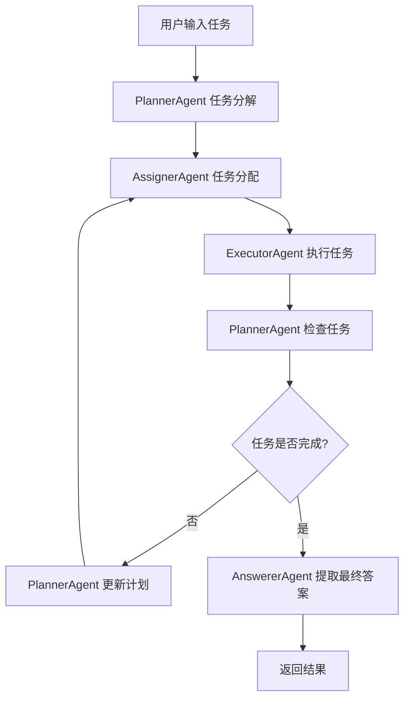

# Workforce Agent

Workforce Agent 是一个多智能体协作系统，通过将复杂任务分解为子任务，并分配给专门的执行器智能体来完成，最终整合结果生成最终答案。

## 架构概述

Workforce Agent 由以下四个核心组件组成：

1. **PlannerAgent** - 任务规划器：负责将复杂任务分解为可执行的子任务
2. **AssignerAgent** - 任务分配器：负责将子任务分配给最适合的执行器智能体
3. **ExecutorAgent** - 任务执行器：负责执行具体的子任务
4. **AnswererAgent** - 答案提取器：负责从所有子任务结果中提取最终答案

## 工作流程



## 使用方法

### 1. 基本配置

```typescript
import { AgentFactory } from '../src/agents';
import { AgentConfig } from '../src/types';

const workforceConfig: AgentConfig = {
  type: 'workforce',
  name: 'workforce_agent',
  model: {
    provider: 'openai',
    model: 'gpt-4',
    apiKey: 'your-api-key'
  },
  
  // Workforce特定配置
  workforcePlannerModel: {
    provider: 'openai',
    model: 'gpt-4',
    apiKey: 'your-api-key'
  },
  workforceAssignerModel: {
    provider: 'openai',
    model: 'gpt-4',
    apiKey: 'your-api-key'
  },
  workforceAnswererModel: {
    provider: 'openai',
    model: 'gpt-4',
    apiKey: 'your-api-key'
  },
  
  // 执行器智能体配置
  workforceExecutorAgents: {
    SearchAgent: {
      type: 'simple',
      name: 'search_agent',
      model: {
        provider: 'openai',
        model: 'gpt-4',
        apiKey: 'your-api-key'
      },
      tools: ['search', 'web_search'],
      instructions: 'You are a web search specialist.'
    }
  },
  
  // 执行器配置
  workforceExecutorConfig: {
    maxTries: 2,
    returnSummary: true
  },
  
  // 执行器信息
  workforceExecutorInfos: [
    {
      name: 'SearchAgent',
      description: 'A web search specialist for finding information.'
    }
  ]
};
```

### 2. 创建和运行

```typescript
// 创建workforce智能体
const workforceAgent = await AgentFactory.createAgent(workforceConfig);

// 运行任务
const result = await workforceAgent.run("What's the weather like in Shanghai tomorrow?");

console.log('结果:', result.output);
```

### 3. 使用YAML配置文件

```yaml
# configs/workforce.yaml
type: workforce
name: workforce_agent

model:
  provider: openai
  model: gpt-4

workforcePlannerModel:
  provider: openai
  model: gpt-4

workforceExecutorAgents:
  SearchAgent:
    type: simple
    name: search_agent
    model:
      provider: openai
      model: gpt-4
    tools:
      - search
      - web_search

workforceExecutorInfos:
  - name: SearchAgent
    description: A web search specialist
```

## 配置选项

### 模型配置

- `workforcePlannerModel`: 任务规划器使用的模型
- `workforceAssignerModel`: 任务分配器使用的模型  
- `workforceAnswererModel`: 答案提取器使用的模型

### 执行器配置

- `workforceExecutorAgents`: 执行器智能体配置映射
- `workforceExecutorConfig`: 执行器全局配置
  - `maxTries`: 任务执行的最大重试次数
  - `returnSummary`: 是否返回任务执行摘要
- `workforceExecutorInfos`: 执行器信息列表

## 核心组件详解

### PlannerAgent

负责任务分解和规划：

- **planTask()**: 将复杂任务分解为子任务
- **planUpdate()**: 根据执行结果更新任务计划
- **planCheck()**: 检查子任务的完成情况

### AssignerAgent

负责任务分配：

- **assignTask()**: 将下一个任务分配给最适合的执行器智能体

### ExecutorAgent

负责任务执行：

- **executeTask()**: 执行分配的子任务
- 支持重试机制和反思改进
- 可配置是否返回执行摘要

### AnswererAgent

负责最终答案提取：

- **extractFinalAnswer()**: 从所有子任务结果中提取最终答案
- **answerCheck()**: 检查答案的准确性

## 数据流

1. **任务输入** → WorkspaceTaskRecorder
2. **任务分解** → Subtask[]
3. **任务分配** → 更新Subtask.assignedAgent
4. **任务执行** → 更新Subtask.taskResult
5. **结果整合** → 最终答案

## 错误处理

- 执行器智能体支持重试机制
- 任务失败时会进行反思和改进
- 支持部分成功状态
- 完整的错误追踪和日志记录

## 扩展性

- 可以轻松添加新的执行器智能体类型
- 支持自定义提示词模板
- 可配置的模型和参数
- 模块化设计便于维护和扩展

## 示例

查看 `examples/workforce_example.ts` 获取完整的使用示例。

## 注意事项

1. 确保所有配置的模型都有有效的API密钥
2. 执行器智能体需要配置相应的工具
3. 任务分解的质量直接影响最终结果
4. 建议为不同类型的任务配置专门的执行器智能体
